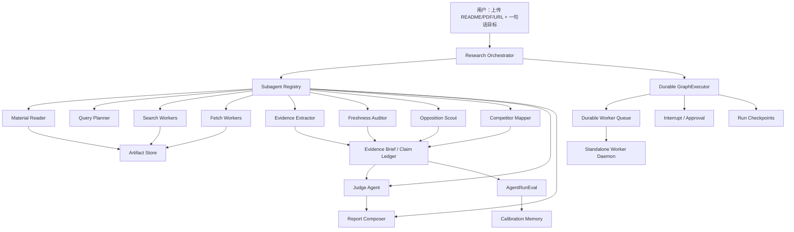

# Agent 关键遗漏审计

日期：2026-06-29

## 结论

这次问题确实严重。我们不是完全没做 subagent，而是没有从第一天把 Product Agent 当成一个长任务、多证据、多工具、可中断、可恢复、可审计的 research agent runtime 来设计。

当前项目已经有 `SubagentRunner`、`ContextManager`、`TaskGraph`、`GraphExecutor`、`Worker Queue`、`Durable Queue`、`Interrupt`、`Resume`、`Trace`、`Artifact` 和回测/盲测台。但这些能力还有相当一部分停留在“运行账本”和“请求内执行”。成熟 Agent 需要的是控制平面：谁能派生 subagent、subagent 拿什么上下文、如何限制工具、如何并行、如何暂停、如何恢复、如何评估轨迹、如何避免网页/PDF/README 污染主判断。

一句话：我们已经把“过程可见”做厚了，但“可独立运行的 subagent 执行系统”还不够厚。

## 为什么这应该一开始就想到

因为这个产品不是普通聊天产品。用户上传 README/PDF 后，系统要做的是：

- 读材料，抽假设。
- 搜网页，抓正文。
- 查反证，查竞品，查时效。
- 把证据压缩成卡片。
- 按生命周期判断证据标准。
- 如果证据不够，就暂停或补查。
- 最后才写报告和下一步实验。

这天然会制造大量上下文噪音：搜索结果、网页正文、失败日志、PDF 文本、GitHub issue、竞品页面、过期新闻、无 URL 摘要。主 Agent 如果直接吞这些内容，判断会变脆，且失败后只能重跑整条链。

所以 subagent 在这里不是“优化项”，而是基础设施。Claude Code 的 subagent 文档直接把搜索结果、日志、文件内容这类会淹没主对话的任务列为典型场景；每个 subagent 有独立 context window、system prompt、工具权限和权限边界，只返回摘要。Anthropic 的 context engineering 也强调长任务要靠 compaction、structured note-taking 和 multi-agent architectures，而不是把更多原文塞进上下文。

## 外部成熟 Agent 的关键共识

### 1. Claude Code：subagent 是上下文隔离单元

Claude Code 的做法不是简单“多叫一次模型”，而是让每个 subagent 拥有：

- 独立 context window。
- 自己的 system prompt。
- 具体工具权限。
- 独立 permission boundary。
- 可配置模型、记忆、hook、最大轮数和后台运行。

启发：我们的网页搜索、网页抓取、PDF/README 深读、反证侦察、竞品映射、时效审计都应该是默认隔离的 subagent，而不是主流程函数里的子步骤。

来源：

- https://code.claude.com/docs/en/sub-agents

### 2. Anthropic Context Engineering：上下文是有限预算

Anthropic 把 context engineering 定义为管理每次推理时进入模型的 token 集合。它强调要找到最小高信号上下文，长任务要通过 just-in-time retrieval、compaction、structured note-taking 和 sub-agent architectures 维持连续性。

启发：我们现有 `ContextManager` 只是记录/压缩第一版，还必须升级成硬边界。主 Agent 和报告模型不应该直接看到网页全文、搜索原始结果、PDF 原文和失败日志，只能看到 Evidence Brief、Handoff Packet、citation refs 和少量结构化摘要。

来源：

- https://www.anthropic.com/engineering/effective-context-engineering-for-ai-agents

### 3. OpenAI Agents SDK：handoff、guardrail、trace 是一等对象

OpenAI Agents SDK 把 agent 定义为带 instructions、tools、handoffs、guardrails、structured outputs 的运行单元；tracing 覆盖 LLM generation、tool call、handoff、guardrail 和 custom event。

启发：我们不能只在 UI 上展示“工具调用过”。每个工具和 subagent 都要有输入 schema、输出 schema、guardrail、成本、状态、handoff、trace span 和 replay 锚点。

来源：

- https://openai.github.io/openai-agents-python/agents/
- https://openai.github.io/openai-agents-python/handoffs/
- https://openai.github.io/openai-agents-python/guardrails/
- https://openai.github.io/openai-agents-python/tracing/

### 4. LangGraph：checkpoint、store、interrupt 要分开

LangGraph 把短期运行状态交给 checkpointer，把长期记忆交给 store；interrupt 会在图的某个节点暂停，保存状态，等待外部输入后继续。

启发：我们不能用 memory 代替 checkpoint，也不能用 resumePlan 代替真正的 executor。要明确三件事：

- Checkpoint：这一次分析跑到哪个节点、输入输出是什么、如何恢复。
- Memory：跨产品/跨运行学到了什么，带来源和过期策略。
- Interrupt：何时停下来等用户补 key、补材料、批准深查或接受降级。

来源：

- https://docs.langchain.com/oss/python/langgraph/persistence
- https://docs.langchain.com/oss/python/langgraph/interrupts
- https://docs.langchain.com/oss/python/concepts/memory

### 5. AutoGen：多 Agent 需要 team 协议、终止条件和可观察性

AutoGen 强调 team 是一组 agent 协作完成共同目标，也提醒复杂任务才值得上多 agent，因为它需要更多脚手架来控制。Human-in-the-loop 如果只是阻塞等待，长任务会处于不可保存/不可恢复的脆弱状态。

启发：我们的 subagent 不能只是并发调用。它需要 team/run 协议：谁是 supervisor、谁能启动谁、何时终止、何时合并、何时请求人类输入、如何保存恢复点。

来源：

- https://microsoft.github.io/autogen/stable/user-guide/agentchat-user-guide/index.html
- https://microsoft.github.io/autogen/stable/user-guide/agentchat-user-guide/tutorial/teams.html
- https://microsoft.github.io/autogen/stable/user-guide/agentchat-user-guide/tutorial/human-in-the-loop.html

### 6. MCP：工具和资源必须 schema 化

MCP 把 tools 和 resources 都做成带 schema 和元数据的标准接口，并强调工具调用需要清晰 UI、人类可见、必要时能拒绝。

启发：`web_search`、`web_fetch`、`file_read`、`pdf_extract`、`ocr`、`github_import`、`judge`、`model_report`、`follow_up` 都要纳入统一 Tool Registry，且工具输出不能随便进入模型上下文。

来源：

- https://modelcontextprotocol.io/docs/getting-started/intro
- https://modelcontextprotocol.io/specification/2025-06-18/server/tools
- https://modelcontextprotocol.io/specification/2025-06-18/server/resources

### 7. OWASP：外部内容必须视为不可信输入

OWASP LLM Top 10 把 Prompt Injection 列为高风险，并特别指出 indirect prompt injection 来自网站、文件等外部源。

启发：README、PDF、网页、GitHub issue、竞品页面、截图 OCR 都是 untrusted evidence。它们只能进入 extractor 的隔离上下文，经过结构化 Evidence Card 后才能影响判断。报告模型不能直接吃外部原文。

来源：

- https://genai.owasp.org/llmrisk/llm01-prompt-injection/

## 当前项目已经有的能力

这些方向是对的：

- `SubagentRunner v2`：网页调研、Judge、Report Composer 已进入统一 worker transcript、context pack、budget warning、failure code。
- `ContextManager`：已有 query_plan / web_search / web_fetch / judge / model_report 的 context pack 和 dropped refs。
- `GraphExecutor v1`：TaskGraph 已有 definition、execution、依赖、priority、lease、freshness、ready/blocked/stale 状态。
- `Worker Queue / Durable Queue`：搜索/抓取 worker 会保存 durable record、input payload、attempt、lease、artifact refs。
- `Durable Replay / Drain`：web_search / web_fetch 已能从 durable record replay，`pnpm worker:drain` 已能通过应用 API drain 队列。
- `Hard Interrupt / Resume`：缺 key、Judge block 等能生成 active hard interrupt，并桥接 runtime resume。
- `Tool Policy`：web/file/pdf/ocr/github/follow-up 等已纳入第一版 tool policy 和 guardrail trace。
- `Code Executor v1.6`：`code_execute` 已作为高风险工具进入 `code_executor` subagent、context pack、task node、artifact、handoff 和 Runner Enforcement；实验 CSV/JSON 可做受限 Python 汇总并生成 `summary_chart.svg`，已补路径、资源、输出预算审计、durable replay、SVG artifact preview、MIME/SVG 安全审计、可选 Docker no-network 后端、运行中取消、cleanup audit、报告页 worker queue 控制台和 replay 后实验证据局部刷新。
- `Evidence Brief / Stop Rule / Backtest / Blind-test`：证据约束、生命周期证据标准、README 后验校准已有第一版。

问题是：这些还没有完全组合成一个严格的 Agent Runtime。
尤其是代码执行虽然已支持 Docker 严格模式，但默认部署仍可能降级到进程级受限执行，且还不是微虚拟机/远端隔离执行环境；它适合做上传数据计算校验，不适合无条件执行任意不可信用户自定义程序。

## 我真正遗漏或低估的能力

### P0-1：Subagent Registry 还不是一等对象

当前有 `AgentRuntimeSubagentId` 和 `AgentWorkerDefinition`，但还没有一份正式 registry 约束每个 subagent：

- 适用任务。
- 输入 artifact 类型。
- 输出 schema。
- 允许工具。
- 模型/provider 路由。
- 上下文预算。
- 可读记忆 namespace。
- 可写 artifact 类型。
- interrupt/retry/timeout 策略。
- 评估指标。

风险：worker 虽然有账本，但不同 worker 的边界仍靠调用处自觉维护，后续功能多了容易再次变散。

### P0-2：独立 worker daemon 还没完成

当前 durable drain 仍通过本地应用 API 执行。它比浏览器内执行强，但还不是完全独立的后台执行系统。

缺口：

- 独立进程直接消费 durable queue。
- 心跳、锁、lease owner、并发组、退出恢复。
- 任务取消、requeue、超时失败的可操作面板。
- worker process crash 后可继续。
- 不依赖浏览器请求生命周期，也尽量不依赖 Next API 在线。

风险：长网页抓取/大量搜索/补证 loop 还是容易被开发服务器、浏览器刷新、API 超时影响。

### P0-3：Context Budget 还不是硬约束

现在 `ContextManager` 会生成 context pack，但更多是记录和压缩，没有形成全链路强制协议。

需要：

- 大原文只能落 artifact，不准进入主 Agent prompt。
- 每个 stage 的输入必须通过 ContextManager。
- 所有 dropped context 都要可审计。
- report model 输入由 Evidence Brief / Judge / Handoff / citation refs 生成。
- 超预算必须先 compaction，再继续。

风险：上下文一旦被长网页和搜索噪音污染，模型报告会变主观，且无法解释哪个证据影响了判断。

### P0-4：Checkpoint 和 Memory 还没分层

当前有 snapshot、resumePlan、analysis records、calibration context，但还没有正式区分：

- Run checkpoint：单次分析的节点状态。
- Artifact store：原始输入和中间产物。
- Product memory：某个产品历史定位、实验、材料版本。
- Calibration memory：回测偏差和判断权重。
- Procedural memory：判断规则和工具失败经验。

风险：如果先做 memory，很容易把旧结论、旧网页、旧校准误用到新分析，反而让客观判断变差。

### P0-5：Tool Security 还不够系统

已有 guardrail，但还缺全局安全边界：

- SSRF/内网/metadata URL 拦截要集中化。
- Secret redaction 要覆盖 trace、artifact、prompt、错误日志。
- 外部网页/PDF/README 的 prompt injection 要有统一隔离标签。
- 高风险工具调用要 human approval。
- 对恶意 README/网页做红队样本。

风险：产品材料和网页都可能带指令，尤其这个产品主动抓网页，攻击面比普通 chat app 大。

### P0-6：AgentRunEval 还不完整

当前回测和盲测更偏最终结果/报告质量，还缺“轨迹评估”。

需要评估：

- 是否查了支持、反证、时效、竞品。
- 是否把搜索摘要误当证据。
- 是否使用过期证据支撑强结论。
- 是否重复/浪费查询。
- 是否在证据不足时正确 interrupt。
- 是否能从失败节点局部恢复。
- 是否遵守成本和时间预算。
- Judge 是否压住报告模型。

风险：报告看起来会越来越完整，但 agent 实际查证质量可能没有持续变好。

### P0-7：Evidence Provenance / Freshness 还不到位

已有 publishedAt、updatedAt、recencyBucket、Source Budget，但还缺严格可核验机制：

- source hash。
- fetch time。
- publish/update time 的来源字段。
- 引用片段 checksum。
- 网页快照版本。
- 证据过期刷新器。
- 生命周期相关 freshness policy。
- 同一 claim 的冲突证据合并规则。

风险：产品生命周期很敏感。AI 工具、开发者基础设施、搜索产品、社交产品的证据半衰期不同，不处理时效会产生高置信过期判断。

### P1-1：Provider Router / Cost Ledger 不够

多 subagent 之后成本会放大，需要按任务选择模型和搜索 provider。

需要：

- material reader 用强理解模型。
- search planner 用便宜模型或确定性规则。
- web search 用带搜索能力 provider。
- evidence extractor 可用便宜模型/规则。
- report/judge 分开。
- 每个 run 记录模型、tokens、search count、fetch count、latency、失败率。

风险：没有成本账本，MVP 一旦有人用，调研质量和成本无法权衡。

### P1-2：Agent Tree UI 还不够像控制台

现在前端能看到 task、worker、tool、artifact、interrupt，但还不够像一个可操作的 agent harness。

需要：

- Supervisor -> subagents -> tools 的树。
- 每个节点实时状态、输入摘要、输出 artifact、失败原因。
- 可点击 retry/skip/cancel/approve/deepen。
- 显示 context budget、dropped refs、freshness、cost、latency。
- 显示“这一步的结论能不能用于报告”。

风险：用户虽然能看到过程，但难以判断过程质量，也不能有效介入。

### P1-3：数据集策略还不够

你说得对，数据量不够时回测作用有限。但并不是要先追求大数据量，而是要先做“高信息密度样本”：

- 成功但 README 早期看不强的项目。
- README 很会讲但后续没起来的项目。
- 有 GitHub stars 但无商业潜力的库。
- 小众但付费强的工具。
- AI 热点过热后冷却的项目。
- 同一赛道 winner/loser 对照。

风险：没有对照样本，AgentRunEval 会变成自我感觉良好。

## 纠正后的架构

## 新的优先级

### 立即做

1. Subagent Registry v1：把所有 subagent 的输入、输出、工具、预算、模型、记忆、失败、评估标准写成统一定义。
2. Standalone Worker Daemon v1：已补本地独立 drain、心跳/run log、状态 API、报告页 daemon 面板、UI 启停、crash 自动拉起、lease 恢复展示，`code_execute`、`evidence_extract`、`judge` 和 `model_report` 已接入 durable replay/daemon drain；已新增 launchd plist 管理脚本、`worker:launchd`、API launchd 状态、health SLA 和 queue SLA/alerts 快照。下一步把它升级成带生产级隔离和外部告警通道的进程主管。
3. Context Boundary Hardening v1：强制所有高上下文任务只能通过 context pack 和 artifact refs 传递。
4. Tool Security v1：集中化 SSRF、secret redaction、untrusted content、prompt injection guardrail。
5. AgentRunEval v1：每次 run 自动评估轨迹，而不是只看最终报告。

### 随后做

6. Evidence Provenance / Freshness v2：source hash、fetch time、publish/update source、quote checksum、stale refresh。
7. Memory Store v1：Product / Calibration / Procedural 三层记忆，带来源、时效、适用范围和冲突处理。
8. Agent Harness v2：从运行账本升级为可操作控制台，支持 retry/skip/cancel/approve/deepen。
9. Provider Router / Cost Ledger：按任务选模型，记录成本、延迟、失败率。
10. 高信息密度回测样本：先补 20-30 个对照样本，不追求大而散。

## 对之前决策的复盘

我前面的错误不是没意识到 subagent，而是把它当成“运行过程可见性”和“稍后优化项”，没有把它当成 Product Agent 的地基。

更准确的设计顺序应该是：

1. 先定义 Agent Runtime。
2. 再定义 subagent registry。
3. 再定义 context/artifact/handoff 协议。
4. 再做 tool security 和 durable execution。
5. 再做 evidence/judge/report。
6. 最后才扩展 UI、记忆和更多回测样本。

现在项目已经补了不少地基，但还需要继续往 runtime 收敛，不能再平均铺功能。
