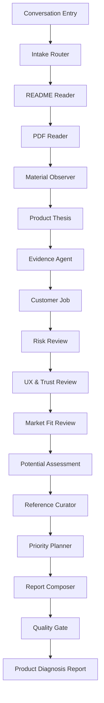

# Product Agent 工作流 Schema 与 Tool Use

## 1. 产品入口

入口只有一个：

> 用户上传 README、产品介绍 PDF 或其他产品材料，并用自然语言说明当前想验证的问题。后续由 Agent 自动读取材料、抓取网页证据、拆解任务、调用工具、生成产品潜力和诊断报告。

用户不需要选择作品类型、填写目标气质或手动选择参考方向。这些都由 Agent 自动推断。

## 2. 不展示隐藏思维链

产品不展示模型内部 chain-of-thought。

产品展示的是 observable workflow trace：

- Agent 做了哪一步。
- 调用了什么工具。
- 输入摘要是什么。
- 输出摘要是什么。
- 哪些材料证据进入了最终报告。

这样既能让用户感到 Agent 在工作，也不会暴露不可控的内部推理。

## 3. Workflow



## 4. Agent State Schema

```ts
type AgentState = {
  analysisId: string;
  userInput: UserInput;
  materials: UploadedMaterial[];
  inferredContext: InferredContext;
  observations: MaterialObservation[];
  webResearch: WebResearchSummary;
  riskReview: ProductRiskReview | null;
  evidenceBrief: EvidenceBrief | null;
  references: ReferenceCandidate[];
  priorityActions: PriorityAction[];
  report: ProductDiagnosisReport | null;
  trace: AgentTraceStep[];
};
```

## 5. User Input Schema

```ts
type UserInput = {
  brief: string;
  source?: "web" | "mobile" | "api";
};
```

## 6. Material Schema

```ts
type UploadedMaterial = {
  id: string;
  name: string;
  type: string;
  size: number;
  url: string;
  metrics: ImageMetrics | null;
  extractedText?: string;
  textPreview?: string;
  pageCount?: number;
  extractedUrls?: string[];
};

type ImageMetrics = {
  width: number;
  height: number;
  aspectRatio: number;
  brightness: number;
  contrast: number;
  saturation: number;
  edgeDensity: number;
  dominantColors: string[];
  colorCount: number;
};
```

## 7. Inferred Context Schema

```ts
type InferredContext = {
  workType:
    | "landing_page"
    | "app_screen"
    | "brand_visual"
    | "poster_social"
    | "ai_image"
    | "pitch_deck"
    | "product_brief_pdf"
    | "readme"
    | "other";
  productName: string;
  productThesis?: string;
  targetAudience?: string;
  customerJob?: string;
  launchContext?: string;
  confidence: number;
};
```

## 8. Agent Stage

```ts
type AgentStage =
  | "intake"
  | "readme_reader"
  | "pdf_reader"
  | "material_observer"
  | "product_thesis"
  | "evidence_agent"
  | "customer_job"
  | "risk_review"
  | "ux_trust_review"
  | "market_fit_review"
  | "potential_assessment"
  | "reference_curator"
  | "priority_planner"
  | "report_composer"
  | "quality_gate";
```

## 8.1 Evidence Agent Schema

证据调研阶段是产品潜力判断的核心模块。详细 PRD 见 `EvidenceAgent证据调研系统PRD.md`。

```ts
type EvidenceBrief = {
  productName: string;
  productLifecycleStage:
    | "idea"
    | "prototype"
    | "mvp"
    | "launch"
    | "early_traction"
    | "growth"
    | "mature"
    | "decline"
    | "unknown";
  claimLedger: ClaimLedger;
  evidenceStop?: EvidenceStop;
  evidenceVerdict:
    | "strong_support"
    | "weak_support"
    | "mixed"
    | "weak_opposition"
    | "strong_opposition"
    | "insufficient";
  confidenceScore: number;
  supportScore: number;
  oppositionScore: number;
  sourceDiversityScore: number;
  behaviorStrengthScore: number;
  recencyScore: number;
  temporalValidityScore: number;
  objectiveEvidenceRatio: number;
  currentEvidenceRatio: number;
  staleEvidenceCount: number;
  assumptionCoverageScore: number;
  keyEvidenceClusters: EvidenceCluster[];
  strongestSupport: EvidenceCard[];
  strongestOpposition: EvidenceCard[];
  evidenceGaps: EvidenceGap[];
  decision: ProductDecision;
  recommendedExperiment: ValidationExperiment;
};

type ClaimLedger = {
  claims: ProductClaim[];
  lastUpdatedAt: string;
  overallConfidence: number;
  openQuestions: string[];
};

type ProductClaim = {
  id: string;
  text: string;
  claimType:
    | "target_user"
    | "problem"
    | "frequency"
    | "workaround"
    | "payment"
    | "distribution"
    | "ai_advantage"
    | "trust"
    | "timing"
    | "decision";
  objectiveLevel:
    | "observed_fact"
    | "evidence_interpretation"
    | "model_inference"
    | "hypothesis";
  status: "supported" | "opposed" | "mixed" | "unverified" | "stale";
  supportEvidenceIds: string[];
  opposeEvidenceIds: string[];
  confidence: number;
  temporalValidityScore: number;
  whyItMatters: string;
  whatWouldChangeThisClaim: string[];
};

type EvidenceStop = {
  stopped: true;
  reason: string;
  blockedDecision: "build" | "stop" | "reposition";
  allowedDecision: "test_first";
  minimumEvidenceNeeded: string[];
  recommendedExperiment: ValidationExperiment;
};

type ProductDecision = {
  decision: "build" | "test_first" | "reposition" | "stop";
  confidence: number;
  rationaleClaimIds: string[];
  strongestReason: string;
  strongestCounterReason: string;
  nextMilestone: string;
};

type EvidenceCard = {
  id: string;
  assumptionId: string;
  sourceTitle: string;
  sourceUrl: string;
  sourceType: string;
  publishedAt?: string;
  updatedAt?: string;
  observedAt?: string;
  capturedAt: string;
  recencyBucket: "fresh" | "usable" | "historical" | "unknown_recency";
  recencyWeight: number;
  lifecycleRelevance: number;
  objectiveLevel:
    | "observed_fact"
    | "evidence_interpretation"
    | "model_inference"
    | "hypothesis";
  claim: string;
  signalType: string;
  direction: "support" | "oppose" | "neutral";
  behaviorStrength: 1 | 2 | 3 | 4 | 5 | 6 | 7;
  relevanceScore: number;
  credibilityScore: number;
  recencyScore: number;
  quoteOrSnippet: string;
  interpretation: string;
  caveat: string;
  confidence: number;
};

type ExperimentResult = {
  experimentId: string;
  completedAt: string;
  resultType: "success" | "failure" | "inconclusive";
  observedMetrics: {
    name: string;
    value: number | string;
    target?: number | string;
  }[];
  qualitativeNotes: string[];
  newEvidenceCards: EvidenceCard[];
  claimUpdates: {
    claimId: string;
    previousStatus: ProductClaim["status"];
    nextStatus: ProductClaim["status"];
    confidenceDelta: number;
    reason: string;
  }[];
};
```

## 9. Tool Call Schema

```ts
type AgentToolCall = {
  id: string;
  stage: AgentStage;
  toolName: string;
  status: "completed" | "failed" | "skipped";
  inputSummary: string;
  outputSummary: string;
  latencyMs: number;
};
```

## 10. Trace Step Schema

```ts
type AgentTraceStep = {
  stage: AgentStage;
  title: string;
  status: "completed" | "failed" | "skipped";
  summary: string;
  toolCalls: AgentToolCall[];
};
```

## 11. P0 Tool Use

### validate_materials

输入：

- material files

输出：

- accepted / rejected
- reason

用途：

- 校验文件类型、大小和数量。

### normalize_user_brief

输入：

- user brief

输出：

- cleaned brief
- missing context notes

用途：

- 把用户随手写的一句话整理成可用于后续分析的上下文。

### extract_readme_text

输入：

- README / Markdown / TXT

输出：

- extractedText
- textPreview
- extractedUrls

用途：

- 用户上传 README 时，Agent 自动读取产品定位、安装方式、使用场景、API、demo、官网和文档链接。

### extract_product_urls

输入：

- user brief
- README text

输出：

- public URLs

用途：

- 找出可抓取的官网、GitHub、文档、demo、发布页和参考链接。

### extract_pdf_text

输入：

- product intro PDF

输出：

- extractedText
- textPreview
- pageCount

用途：

- 用户主要上传产品介绍 PDF 时，Agent 自动读取产品定位、目标用户、卖点、功能描述和发布语境。
- MVP 默认读取前 8 页、最多约 12000 字，避免上下文过长。

### summarize_product_brief

输入：

- user brief
- extracted PDF text

输出：

- product summary
- target audience
- value proposition
- launch context

用途：

- 把 PDF 从附件变成 Agent 的核心上下文。

### crawl_extracted_urls

输入：

- extracted URLs

输出：

- title
- url
- snippet

用途：

- 抓取 README 中出现的公开网页，给潜力判断提供外部证据。
- 拒绝 localhost、内网 IP、`.local`、`.internal`。

### web_search_market_context

输入：

- product name
- extracted product thesis

输出：

- search result snippets
- skipped reason

用途：

- 搜索产品、替代方案、竞品、用户评论和市场信号。
- MVP 使用可选 `SERPER_API_KEY`；未配置时必须标记 skipped。

### extract_image_metrics

输入：

- primary image

输出：

- width
- height
- brightness
- contrast
- saturation
- edgeDensity
- dominantColors

用途：

- 在没有视觉模型的 MVP 中，为 DeepSeek 提供可观察视觉信号。

### summarize_material_manifest

输入：

- uploaded materials

输出：

- material list summary

用途：

- 告诉模型用户提供了哪些材料。

### extract_product_thesis

输入：

- combined material context

输出：

- product promise
- target user
- core situation
- differentiation hypothesis

用途：

- 先判断产品主张是否成立，再判断页面和文案。

### identify_job_to_be_done

输入：

- product thesis
- material context

输出：

- customer job
- trigger situation
- alternatives

用途：

- 判断用户想完成什么进步，以及为什么愿意换掉现有替代方案。

### score_problem_intensity

输入：

- customer job
- material context

输出：

- frequency
- pain
- urgency
- willingness to pay
- identity relevance

用途：

- 判断这个产品是否有足够强的问题张力。

### check_product_risks

输入：

- product thesis
- customer job
- material context

输出：

- value risk
- usability risk
- feasibility risk
- business viability risk

用途：

- 按 Marty Cagan 的产品风险框架检查产品假设。

### review_clarity_and_trust

输入：

- material observations
- product thesis

输出：

- clarity issues
- trust issues
- missing proof
- CTA issues

用途：

- 检查新用户能否快速理解、相信并采取下一步。

### check_pmf_signal

输入：

- product context

输出：

- usage signal
- retention signal
- payment signal
- sharing signal
- missing evidence

用途：

- 判断材料是否只有愿景，还是有真实市场反馈。

### check_distribution_fit

输入：

- launch context
- target audience

输出：

- channel fit
- message fit
- acquisition path notes

用途：

- 判断发布渠道、传播话术和产品定位是否匹配。

### score_market_potential

输入：

- README / PDF context
- crawled pages
- search results
- risk review

输出：

- potential_score
- potential_verdict
- market_evidence

用途：

- 回答“这个产品到底有没有潜力”。
- 判断痛点强度、既有需求、替代方案、差异化、分发路径、可信证据和下一步实验。

### separate_evidence_from_inference

输入：

- material evidence
- web evidence
- model inference

输出：

- evidence boundary notes

用途：

- 避免把模型猜测写成外部事实。

### search_reference_library

输入：

- workType
- product thesis
- customer job
- risk profile

输出：

- reference candidates

用途：

- 从内置参考库匹配 Linear、Stripe、Notion、Teenage Engineering、A24 等案例。

### rank_product_actions

输入：

- issues
- risks
- references

输出：

- priority actions

用途：

- 按影响、确定性、成本和学习速度排序行动。

### compose_structured_report

输入：

- observations
- risk review
- references
- priority actions

输出：

- ProductDiagnosisReport JSON

用途：

- 产出最终报告 artifact。

### schema_validate_report

输入：

- ProductDiagnosisReport JSON

输出：

- pass / repair / failed

用途：

- 保证报告不是空泛建议，且符合页面渲染 schema。

## 12. Product Diagnosis Report Schema

```ts
type ProductDiagnosisReport = {
  diagnosis_score: number;
  potential_score: number;
  potential_verdict: string;
  first_impression: string;
  diagnosis_tags: string[];
  market_evidence: {
    signal: string;
    evidence: string;
    interpretation: string;
  }[];
  top_issues: {
    title: string;
    why_it_matters: string;
    how_to_fix: string;
  }[];
  references: {
    name: string;
    category: string;
    why_relevant: string;
    what_to_learn: string;
  }[];
  actionable_suggestions: string[];
  share_summary: {
    current_style: string;
    main_problem: string;
    recommended_references: string;
    one_line_diagnosis: string;
  };
  limitations: string[];
};
```

## 13. P1 Tools

- `web_search_references`
- `crawl_landing_page`
- `crawl_github_repo`
- `search_product_reviews`
- `ocr_visible_text`
- `extract_competitors`
- `generate_launch_message_variants`
- `evaluate_report_quality`
- `create_share_card`
- `create_human_review_task`

## 14. MVP 实现原则

- 用户只和一个对话入口交互。
- 用户只通过一个上传材料处提供 README、PDF、PRD、截图或调研材料。
- Agent 自动推断上下文和产品内问题。
- Agent 自动抓取 README 中出现的公开 URL，并在配置搜索 API 时搜索外部网页。
- 工具调用结果必须可展示。
- 报告是 artifact，不是聊天消息。
- 不暴露隐藏思维链，只展示 workflow trace。
- DeepSeek 当前作为文本推理模型使用，图片能力由本地 canvas 指标补足，产品介绍 PDF 由 `pdfplumber` 提取文本。
