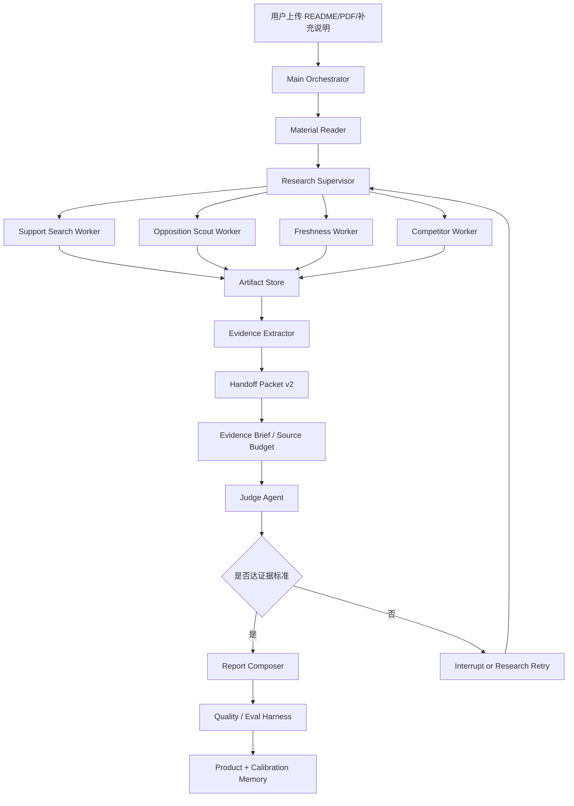

# Agent 架构补漏审计

日期：2026-06-28

## 结论

当前 Product Agent 已经有可见 trace、artifact、worker run、handoff、state snapshot、Evidence Brief、Source Budget、Judge Agent 雏形和回测/盲测台，但还不是成熟 Agent Runtime。

最严重的遗漏是：我们已经把网页搜索、抓取、反证、提取等步骤升级成了可记录的 worker run，但它们仍主要运行在同一条服务端调用链里，还没有真正成为“隔离上下文、独立模型/工具权限、独立预算、独立恢复、独立失败边界”的执行单元。换句话说，现在是“subagent worker 账本第一版”，还不是“subagent 执行系统”。

这会直接影响产品判断质量：如果抓取网页、搜索结果、失败重试和证据压缩都在主流程里串行消耗上下文，长任务会越来越脆弱，结论也容易受局部搜索路径影响。

## 四次严审：Subagent 不是功能项，而是 Agent 的地基

这次遗漏的本质：我把“可见运行账本”推进得比较快，但没有一开始就把“执行控制平面”放到最高优先级。对一个要大量查网页、读 README/PDF、分辨证据时效、做潜力判断的 Product Agent 来说，subagent 不是后期优化，而是防止上下文污染、证据混杂和长任务失控的基础设施。

重新调研后，我把成熟 Agent 的最低能力拆成 12 个硬要求：

| 能力 | 成熟做法 | 当前项目状态 | 缺口 |
| --- | --- | --- | --- |
| Orchestrator | 主 Agent 只规划、分派、合并，不吞所有网页和日志 | 有 Research Supervisor / runtime trace | 缺显式 TaskGraph、队列、依赖和并发控制 |
| Subagent Worker | 每个 worker 有独立输入包、system prompt、工具权限、预算、transcript、产物和失败边界 | 网页调研链路已接 `SubagentRunner` 第一版 | Judge、报告生成、文件读取、GitHub import、OCR、follow-up 仍未统一进入 runner |
| Context Manager | worker 只读 context pack 和 artifact refs，超预算时压缩/丢弃可见记录 | 有 `worker_context` 和 handoff budget | 缺统一 token/char enforcement、dropped context 规则和自动 compaction |
| Tool Registry | 每个工具有 schema、权限、风险、成本、超时、重试、缓存和 guardrail | `tool-policy.ts` 已列出工具，web search/fetch 已较完整 | file_read、github_import、judge、model_report 还没有全量 runtime tool trace |
| Artifact Store | 原文、网页快照、搜索结果、证据卡、报告草案都持久化 | 有 `.taste-data/artifacts` | 缺 source hash、网页抓取时间、引用片段校验、过期刷新策略 |
| Handoff | 子任务只交压缩结论、引用、uncertainty、forbidden claims | Handoff v2 已有 | 还没强制所有阶段只通过 handoff 传递 |
| Durable Execution | 任意节点失败后只重试该节点，支持幂等和 cache | 有 snapshot / resumePlan / tool-cache 第一版 | 缺真正 `resumeFromWorker` / `resumeFromTool` API 和前端操作入口 |
| Human Interrupt | 证据不足、深查超预算、强结论被阻断时暂停请求用户输入 | 报告后可继续对话 | 缺运行中 interrupt 状态和恢复协议 |
| Security | 网页是 untrusted content，不能携带指令污染后续模型 | web_fetch 有提示和基础 URL 安全 | 缺全局 prompt-injection 隔离、secret redaction、权限审批 |
| Memory | 产品记忆、校准记忆、流程记忆分层，且有来源、时间、过期规则 | 只有分析记录和回测校准上下文 | 缺正式 Memory Store 和检索/写入协议 |
| Eval | 评估 agent 轨迹，不只评最终报告 | 有 backtests/blind-tests/report quality | 缺 AgentRunEval：搜索覆盖、反证、时效、引用、恢复、成本 |
| Versioning | 记录 prompt/schema/model/tool/harness 版本，支持 replay | 零散记录模型名 | 缺可回放版本账本 |

结论：现在的系统已经有“证据判断层”和“过程可见层”，但“Agent Runtime 控制层”还没有补齐。继续做 UI 或记忆前，应该先把执行隔离、任务图、上下文管理、恢复和中断做实。

### 我前面遗漏最严重的 8 件事

1. 没有一开始就把网页抓取、搜索、证据抽取视为独立高上下文 worker。
2. 没有把 Judge 和 Report Composer 纳入同一个 worker/tool/handoff/transcript 协议。
3. 没有先设计 TaskGraph，而是让 `web-research.ts` 保持过程式编排。
4. 没有统一 ContextManager，只是局部写了 handoff 和 boundary。
5. 没有做真正单节点恢复 API，只有 resumePlan 账本。
6. 没有设计运行中 interrupt，证据不足时系统仍倾向继续产出报告。
7. 没有把 file_read / GitHub import / OCR 当作高风险工具纳入权限与 guardrail。
8. 没有把 Agent 轨迹评估独立出来，回测还偏最终结果，不够看执行质量。

### 纠正后的 P0 顺序

1. 已完成：把 Judge Agent 和 Report Composer 迁入 `SubagentRunner`，最终判断与报告生成现在都有 worker transcript、tool call、guardrail、artifact 和 handoff。
2. 已完成第一版：抽出 `TaskGraph / ResearchPlan`，让 material_fetch、query_plan、support_search、opposition_search、freshness_search、competitor_search、result_fetch、evidence_extract、自动补证 loop、judge、report 成为显式节点，并挂 span/worker/tool/artifact/handoff 引用。
3. 已完成第一版：做 `ContextManager`，为每类 worker 生成 context pack，统一记录预算、压缩策略、dropped refs、warnings、forbidden inputs 和 isolation notes。
4. 下一步：做 `resumeFromWorker / resumeFromTool` API，前端能对失败节点点“只重试这一步”。
5. 做 `RunInterrupt`，证据不足、需要补 key、需要用户材料或批准深查时暂停，而不是硬写结论。
6. 然后再做 Memory 和 AgentRunEval。记忆必须排在执行控制层之后，否则旧结论会污染还不稳定的判断流程。

### 参考来源

- Claude Code subagents：独立上下文、专用 prompt、工具权限，适合隔离高上下文任务。https://docs.anthropic.com/en/docs/claude-code/sub-agents
- Anthropic multi-agent research：lead agent 分解任务、并行派发 subagent、再合并压缩结果。https://www.anthropic.com/engineering/multi-agent-research-system
- Anthropic effective agents：先用简单 workflow，复杂任务再用 orchestrator-workers / evaluator-optimizer 等模式。https://www.anthropic.com/research/building-effective-agents
- OpenAI Agents SDK：agent、tools、handoffs、guardrails、tracing 是运行时的一等对象。https://openai.github.io/openai-agents-python/
- OpenAI tracing：trace 应覆盖 generation、tool call、handoff、guardrail 和自定义事件。https://openai.github.io/openai-agents-python/tracing/
- LangGraph persistence / interrupts：graph state、checkpointer、interrupt 支持节点级恢复和人机协作。https://docs.langchain.com/oss/python/langgraph/persistence
- AutoGen memory / human-in-the-loop：多 agent 运行需要 team 协议、终止条件、记忆接口和人工接管。https://microsoft.github.io/autogen/stable/user-guide/agentchat-user-guide/index.html

## 二次审计更新：成熟 Agent 还缺什么

这次重新对照 Claude Code、Anthropic Research、OpenAI Agents SDK 和 LangGraph 后，结论更明确：成熟 Agent 的核心不是多几个步骤，而是 harness 必须管理 execution、context、tool policy、state、memory、interrupt 和 eval。

当前最需要补的不是 UI，而是控制平面：

1. 真正的 Subagent Execution Boundary
   - 每个高上下文 worker 应有独立输入包、独立上下文窗口、独立 system prompt、模型/provider、工具 allowlist、预算、输出 schema 和 transcript/artifact。
   - 主 Agent 只拿 Handoff Packet 和 artifact ref，不拿网页全文、搜索原始噪音或子任务长日志。
   - 搜索、网页抓取、证据抽取、反证侦察、时效判断、竞品集合判断都应该是可单独重试/跳过/恢复的 worker。
   - 当前进展：已完成第一版 `executionBoundary` 和 `worker_context` artifact，能审计 worker 输入包、工具权限、上下文预算和恢复策略；仍需后续把 worker 放入真正独立执行器和节点级恢复 API。

2. Context Manager / Compaction Policy
   - 需要显式规定每个阶段能接收什么、保留什么、丢弃什么。
   - 长网页和多结果搜索必须先进入 artifact store，再由 extractor 压缩成 Evidence Card。
   - 当上下文接近预算时，保存 plan、open questions、confirmed facts、forbidden claims 和 next actions，再用新上下文继续。

3. Tool Policy / Guardrail Layer
   - 每个工具调用前应检查输入 schema、URL 安全、成本、重复调用、provider key、批量上限和是否需要用户确认。
   - 每个工具调用后应检查输出是否为空、是否缺 URL/日期、是否只是搜索摘要、是否包含抓取失败、是否能支撑 claim。
   - Guardrail 结果必须进入 runtime trace，前端能看到为什么 blocked / skipped / downgraded。
   - 当前进展：已完成第一版 `web_search` / `web_fetch` tool policy 与 guardrail trace；仍需继续接入读文件、GitHub import、模型报告、Judge 和 interrupt 审批。

4. Durable Resume / Retry / Idempotency
   - 现在有 snapshot，但缺节点级 resume API、工具缓存和幂等执行。
   - 同 query/provider、同 URL、同材料 hash 应可复用结果，避免重跑大流程。
   - 失败恢复应支持“只重试这个 worker / 这个 tool call”，而不是重新跑整份分析。
   - 当前进展：已完成第一版 `resumePlan` 和 `.taste-data/tool-cache`，能生成 worker/tool 级重试目标并对 `web_search` / `web_fetch` 做幂等缓存；仍需后续补真正的单节点重试 API 和用户点击恢复入口。

5. Human Interrupt
   - 缺证据、需要深度搜索、抓取数量超预算、强结论被 Judge 阻断时，应该暂停并给用户一个可操作请求。
   - Interrupt 不是失败，而是正式状态：needs_material / approve_deep_research / clarify_target_user / confirm_competitor_set。

6. Memory System
   - Product Memory：产品定位、目标用户、材料版本、历史判断、实验结果。
   - Calibration Memory：README 高估/低估、证据权重、失败模式、后验结果。
   - Procedural Memory：判断规则、生命周期证据标准、工具失败处理。
   - 每条记忆必须有来源、更新时间、适用范围和过期策略，避免旧结论污染新判断。

7. AgentRunEval
   - 不能只评最终报告，要评 agent 行为本身。
   - 指标包括：证据覆盖、反证覆盖、时效覆盖、引用支撑、来源质量、工具效率、重复查询、失败恢复、强结论是否被正确阻断。

8. Provider Router / Cost Ledger
   - Subagent 并行后成本会放大，需要 per-run 搜索次数、网页抓取数、模型调用数、超时和成本估算。
   - 模型和搜索 provider 要按任务选择：材料理解、网页搜索、证据抽取、报告生成、Judge 不一定使用同一模型。

9. Prompt / Schema / Run Versioning
   - 每次运行要记录 prompt version、schema version、provider version 和 harness version。
   - 否则回测偏差无法判断是产品判断错、搜索 provider 变了、还是 prompt 变了。

10. Web Evidence Security
   - 网页内容可能有 prompt injection，不能直接进入报告模型上下文。
   - 需要把网页作为 untrusted evidence，只允许 extractor 产出结构化证据和 citation，不允许网页正文携带指令。

## 三次严审：这次真正遗漏了什么

这次问题暴露的是架构优先级错误：我们先把“用户能看到过程”做出来了，也把 worker、boundary、tool call、resumePlan 做成了可审计账本，但还没有把这些账本升级成真正的执行控制平面。

对照 Claude Code / Claude Research、OpenAI Agents SDK、LangGraph、AutoGen 和 12-factor agents 后，成熟 agent 至少需要这 15 个能力面。当前项目的缺口如下。

| 能力面 | 成熟 Agent 应该具备 | 当前状态 | 缺口严重度 |
| --- | --- | --- | --- |
| Worker Runtime | 每个 worker 是独立执行单元，有自己的 prompt、上下文、工具权限、预算、状态、产物和失败边界 | 有 `workerRuns`、`executionBoundary`、`worker_context` | P0：还是同一服务端调用链，缺真正 `SubagentRunner` |
| Task Graph / Planner | Orchestrator 生成任务图，支持 fan-out/fan-in、依赖、并发上限、动态补任务 | `web-research.ts` 里是过程式编排 | P0：缺显式 DAG / queue / scheduler |
| Context Manager | 主 agent 只看压缩 handoff；长网页、搜索结果、日志进 artifact；上下文接近预算时自动压缩续跑 | 有 handoff/context budget 第一版 | P0：缺统一 context packer、token/char enforcement、compaction policy |
| Tool Registry | 每个工具有输入/输出 schema、权限、风险、成本、超时、重试、缓存、guardrail | 仅 `web_search` / `web_fetch` 第一版 | P0：file_read、github_import、model_report、judge、OCR、follow-up 都还没纳入 |
| Durable Execution | 每个节点状态可持久化，服务重启/刷新后从节点恢复，不重跑整条链 | 有 run log、snapshot、resumePlan | P0：缺真正 `resumeFromWorker` / `resumeFromTool` API |
| Human Interrupt | 缺材料、深查超预算、强结论被阻断时正式暂停，等用户补证/批准后恢复 | 只有报告后继续对话 | P0：缺运行中 interrupt 状态和恢复入口 |
| Memory | 产品记忆、校准记忆、流程记忆都有来源、时间、适用范围、过期策略 | 尚未实现 | P1：重要，但应排在执行隔离后 |
| AgentRunEval | 评估 agent 轨迹，不只评最终报告；覆盖搜索质量、反证、时效、引用、成本、恢复 | 有回测/盲测和报告质检 | P1：缺自动 trajectory eval |
| Security / Permissions | 工具权限、SSRF、prompt injection、secret redaction、untrusted web isolation、审批 | 有基础 URL 安全和 untrusted 提示 | P0：缺全局 permission policy 和网页注入隔离 |
| Provider Router | 按任务选择模型/搜索 provider，记录成本、延迟、失败率和质量 | 智谱/DeepSeek/Serper 基本选择 | P1：缺动态路由和成本账本 |
| Versioning / Replay | 记录 prompt/schema/model/harness/tool provider 版本，支持同输入 replay | 基本未覆盖 | P1：影响回测可信度 |
| Source Provenance | 原始网页快照、hash、抓取时间、发布日期、引用片段和 claim 绑定可核验 | 有 artifact 和证据绑定 | P1：缺 source hash、引用校验器和过期证据刷新 |
| Failure Taxonomy | 把失败区分为缺 key、provider、网络、schema、guardrail、证据不足、用户输入不足 | 局部有 reason | P1：缺统一 failure code |
| Long-run Ops | 长任务队列、后台 worker、取消、超时、并发控制、运行状态面板 | 当前 API 流式执行 | P0/P1：MVP 可用，但长任务会脆 |
| UX for Thought Process | 展示任务流、工具、证据、边界、阻断原因和下一步，不展示隐藏思维链 | 已有第一版 | P1：还要把执行状态从 trace 展示升级成可操作控制台 |

一句话判断：当前系统是“Agent 可见性层 + 证据判断层”已经比较厚，但“Agent 执行控制层”还薄。真正要补的是 runtime，不是继续堆报告页面。

## 纠正后的优先级

这次审计后，下一批优先级应该调整为：

1. `SubagentRunner v2`
   - 新增统一 worker 执行器：接收 `AgentWorkerDefinition` + input artifact，执行、限流、写 artifact、生成 handoff。
   - 主流程不再手写一堆 start/complete worker，而是通过 runner 执行。
   - 每个 worker 必须有输入包、输出 schema、预算检查、失败分类、重试策略和 transcript artifact。
   - 当前进展：网页调研链路、Judge Agent 和 Report Composer 已完成 runner 迁移，新增 `SubagentRunner`、`worker_transcript`、`failureCode`、Runner / Manual 标记和 transcript 展示；Query Planner、Opposition Routing、搜索类 worker、Web Fetch Worker、Judge 和模型报告都已迁入统一 runner。

2. `TaskGraph / ResearchPlan`
   - 把 web research 从过程式函数升级为显式任务图。
   - 节点包括 material_fetch、query_plan、support_search、opposition_search、freshness_search、competitor_search、result_fetch、evidence_extract、自动补证 loop、judge、report。
   - 当前进展：第一版已完成，`AgentRuntimeTrace.taskGraph` 会记录节点依赖、状态、span、worker、tool、artifact、handoff 引用；报告页和 `/backtests` 已可见。
   - 后续仍需用 ContextManager 进一步强制节点之间只通过 artifact refs 和 handoff 传递，不直接传大对象。

3. `ContextManager`
   - 为每类 worker 生成 context pack：goal、accepted inputs、artifact refs、forbidden inputs、budget、expected output。
   - 超预算时写入 dropped context，并让 worker 只能读压缩材料。
   - 主 agent 的输入只允许 Evidence Brief、Judge Verdict、Handoff Packet 和少量 artifact refs。
   - 当前进展：第一版已完成，所有 `SubagentRunner` worker 会自动生成 `AgentContextPack`，保存到 `worker_context` artifact，并在 executionBoundary 上显示 contextPackId、compressionStrategy、contextWarnings 和 droppedInputArtifactIds。

4. `Node-level Resume API`
   - 补 `POST /api/agent-runtime/resume` 或分析内嵌 resume endpoint。
   - 能针对单个 worker/tool 重试、跳过、补 key、补材料后恢复。
   - UI 上让用户看到“这一步失败，可以只重试这一步”。

5. `Human Interrupt`
   - 运行中出现证据不足、深查超预算、竞品集合不确定、强结论被 Judge 阻断时，正式进入 interrupt。
   - interrupt 必须保存 snapshot，用户补材料或批准后从该节点继续。

6. `Memory System`
   - 执行层稳定后再补 Product / Calibration / Procedural Memory。
   - 记忆只能作为 evidence/context hint，不能绕过当前证据标准。

7. `AgentRunEval`
   - 对每次 run 自动生成 trajectory eval，评估 agent 是否查够、是否查反证、是否引用可信、是否浪费工具、是否可恢复。

这意味着：原来把 Memory 放在第一位，现在要往后移。先修执行控制层，再做记忆和评测，否则 memory 会把历史结论带进一个还不够稳的运行系统里。

## 参考到的成熟模式

### Claude Code / Claude Research

值得吸收：

- Subagent 应该有独立 context window、专属 system prompt、工具权限和独立权限边界。
- 适合把会污染主上下文的任务交给 subagent，例如搜索结果、日志、大文件和网页正文。
- 多 Agent Research 的 lead agent 会规划任务，派生多个 subagent 并行搜索，再让 subagent 返回压缩结论。
- 长任务需要外部 memory / artifact 保存计划和中间产物，避免上下文压缩或截断后丢失关键状态。
- Subagent 输出可以直接落文件或 artifact store，只把轻量引用交回主 Agent，减少“转述损耗”。

对应来源：

- https://code.claude.com/docs/en/sub-agents
- https://code.claude.com/docs/en/how-claude-code-works
- https://code.claude.com/docs/en/memory
- https://code.claude.com/docs/en/checkpointing
- https://www.anthropic.com/engineering/multi-agent-research-system

### OpenAI Agents SDK

值得吸收：

- Agent runtime 不只是一次模型调用，而是 orchestration、tool execution、state、approval、handoff 和 observability 的组合。
- Handoff 是明确的 agent-to-agent 边界，不只是 UI 记录。
- Trace 应覆盖 model generation、tool call、handoff、guardrail 和 custom event。
- Guardrail 应该挂在工具调用前后，用来验证、阻断或降级，而不是只在最终报告后质检。
- Result/state 是产品逻辑的一等对象：暂停、继续、人工审批、下一轮输入都要能从 result/state 恢复。

对应来源：

- https://developers.openai.com/api/docs/guides/agents
- https://developers.openai.com/api/docs/guides/agents/orchestration
- https://developers.openai.com/api/docs/guides/agents/guardrails-approvals
- https://developers.openai.com/api/docs/guides/agents/results
- https://openai.github.io/openai-agents-python/tracing/
- https://openai.github.io/openai-agents-python/guardrails/

### LangGraph

值得吸收：

- Graph state + checkpointer 用于短期、线程级恢复。
- Store 用于长期、跨线程记忆。
- Interrupt 是正式的人机协作边界：可以在任意节点暂停，持久化状态，等待用户审批/编辑后恢复。
- 这比“失败后重新开始”更适合产品分析，因为用户可能只想补一个材料或批准一次深查。

对应来源：

- https://docs.langchain.com/oss/python/langgraph/persistence
- https://docs.langchain.com/oss/python/langgraph/interrupts
- https://docs.langchain.com/oss/python/concepts/memory
- https://docs.langchain.com/oss/python/langchain/long-term-memory

### AutoGen

值得吸收：

- 多 Agent 应该有 team / group chat / termination condition 等运行协议。
- Human-in-the-loop 可以通过 handoff termination 把控制权交回应用，再由应用持久化和恢复。
- Memory 协议至少需要 query、update_context、add、clear 等基本操作。

对应来源：

- https://microsoft.github.io/autogen/stable/user-guide/agentchat-user-guide/index.html
- https://microsoft.github.io/autogen/stable/user-guide/agentchat-user-guide/tutorial/human-in-the-loop.html
- https://microsoft.github.io/autogen/stable/user-guide/agentchat-user-guide/memory.html

## 当前项目已经有的

1. 可见流程
   - 首页 stream progress。
   - 报告页 trace/harness。
   - backtests/blind-tests runtime trace。

2. 证据系统
   - Evidence Brief。
   - Source Budget。
   - Evidence Stop。
   - Claim Ledger。
   - Evidence Card 和报告段落绑定。

3. 网页调研流程
   - Query Planner。
   - Search Worker span。
   - Web Fetch Worker span。
   - Opposition Scout span。
   - Evidence Extractor handoff。

4. Artifact Store
   - `.taste-data/artifacts` 保存查询计划、搜索结果、网页摘要和失败报告。
   - 前端可以展开 artifact payload。

5. 恢复雏形
   - run log。
   - checkpoint summary。
   - 失败任务重跑入口。

6. 评估雏形
   - 报告质检。
   - README 回测。
   - blind test。
   - Judge Agent 初版。

## 关键遗漏

### P0. 真正的 Subagent Worker Runtime

现状：`AgentRuntimeHarness` 只记录 span/artifact/handoff；`web-research.ts` 仍在同一服务端调用链里执行搜索、抓取、压缩。

问题：

- 没有独立 context。
- 没有独立 model/provider 配置。
- 没有 worker 输入/输出 schema。
- 没有 per-worker token/tool/time budget。
- 没有并行 worker 调度。
- 没有 worker 级失败隔离和 retry。

应补：

- `AgentWorkerDefinition`：id、role、systemPrompt、tools、budget、outputSchema。
- `AgentWorkerRun`：workerId、input、status、attempts、budgetUsed、artifactRefs、handoff。
- `SubagentRunner`：执行 worker，持久化输入、输出、错误和 artifact。
- `ResearchSupervisor`：按复杂度派发 1-N 个 worker，例如 support-search、opposition-search、freshness-search、competitor-search。
- 主 Agent 只接收 Handoff Packet，不接收网页全文。

### P0. Context Engineering / Compaction / Handoff Packet

现状：已有 handoff summary，但没有完整上下文预算和压缩策略。

问题：

- 大量网页正文仍可能通过对象传递在主流程里膨胀。
- 不知道每个阶段应该保留什么、丢弃什么。
- 失败恢复时无法精确恢复到某个 worker 的输入输出。

应补：

- `ContextBudget`：每阶段最大字符/token、artifact 引用数量、证据卡数量。
- `HandoffPacket` 升级：goal、acceptedInputs、sourceArtifacts、keyFindings、uncertainties、nextQueries、forbiddenClaims。
- `ContextCompressor`：把网页正文压成证据卡和引用，不让主流程吞原文。
- `RunStateSnapshot`：每个阶段保存可恢复状态。

### P0. Tool Policy / Guardrail Layer

现状：有 URL 安全过滤和质量质检，但不成体系。

问题：

- 搜索、抓网页、读文件、调用模型都没有统一 pre/post guardrail。
- 不能在工具调用前判定成本、风险、重复、是否需要用户确认。
- 工具失败只在局部被记录，未形成全局策略。

应补：

- `ToolRegistry`：工具名、输入 schema、输出 schema、cost、risk、timeout、retryPolicy。
- `ToolGuardrail`：precheck / postcheck / tripwire。
- `ToolCallRecord`：每次工具调用都保存输入摘要、输出摘要、错误、耗时、成本估算、artifactRefs。
- 高风险或高成本动作引入 interrupt，例如深度搜索超过 N 次、抓取大量网页、结论需要强决策但证据不足。

### P0. Task Retry / Resume / Idempotency

现状：有 run log 和失败重跑，但不是节点级恢复。

问题：

- 某个 worker 失败时，常常需要重跑较大流程。
- 对重复搜索/抓取没有缓存和幂等键。
- UI 不能对单个失败 span 做“重试这个任务”。

应补：

- `retryPolicy`：maxAttempts、backoffMs、retryableErrors。
- `idempotencyKey`：query/provider/url/hash。
- `resumeFromSpan(spanId)`。
- artifact/cache 命中：同 URL、同 query、同 provider 不重复消耗。
- 前端 span 卡片提供重试入口。

### P1. Memory System

现状：有分析记录、回测账本，但没有统一记忆层。

问题：

- 用户同一个产品多次上传材料，系统没有“产品长期记忆”。
- 回测校准、失败模式、用户偏好、产品生命周期变化没有统一检索入口。
- Agent 不能主动回忆“之前这个产品为什么被降权”。

应补三层：

- Product Memory：产品定位、用户、关键假设、材料版本、历史结论、实验结果。
- Calibration Memory：README 高估/低估案例、证据权重、失败模式、后验校准。
- Procedural Memory：本产品判断规则、生命周期证据标准、工具失败处理规则。

暂缓：

- 泛化用户偏好记忆。当前产品判断更需要客观证据，偏好记忆晚一点做。

### P1. Evaluation Harness

现状：有 backtests、blind-tests，但还没有把 Agent 行为本身作为被评估对象。

问题：

- 只评最终报告不够。
- 需要评估搜索是否覆盖、反证是否真实、引用是否支撑 claim、工具成本是否合理。

应补：

- `AgentRunEval`：每次 run 自动打分。
- 指标：证据覆盖、反证覆盖、引用准确、时效覆盖、工具效率、重复查询、失败恢复。
- 小样本持续 eval：先 10-20 个真实项目，不等大数据。
- End-state eval：看最终 evidence state 是否达到标准，而不是强求固定路径。

### P1. Human-in-the-loop Interrupt

现状：用户可以在报告后继续对话，但不能在运行中接管。

问题：

- 缺证据时，系统应该暂停并请求用户上传材料，而不是硬写弱结论。
- 高成本深查前，应该让用户确认。

应补：

- `RunInterrupt`：needs_user_evidence / approve_deep_research / clarify_target_user / confirm_competitor_set。
- UI 展示“Agent 卡住在哪里、需要什么输入、继续后从哪里恢复”。

### P2. Cost / Budget / Provider Router

现状：智谱/DeepSeek/Serper 选择较硬编码。

问题：

- 没有把模型成本、搜索成本、成功率、延迟纳入调度。
- Subagent 并行后如果没有 budget，很容易烧钱。

应补：

- `BudgetManager`：per-run 搜索次数、抓取网页数、模型调用数、最长运行时间。
- `ProviderRouter`：按任务选择模型/搜索 provider。
- `CostLedger`：每次 run 展示估算成本和节流原因。

## 优先级判断

先补 P0，不然继续加功能会越来越像堆页面：

1. 真正的 Subagent Worker Runtime。
2. Context/Handoff Packet v2 和 RunStateSnapshot。
3. Tool Policy / Guardrail Layer。
4. Span 级 Retry/Resume。

然后再做：

5. Product Memory + Calibration Memory。
6. AgentRunEval。
7. Human Interrupt。

## 对 Product Agent 的目标架构

## 当前应立即修正的设计口径

- 我们不应该说“已经有 subagent 了”，更准确说法是“已有 subagent trace 和 artifact 账本，正在补真正 worker runtime”。
- 给用户看的不是隐藏思维链，而是可验证的任务流、工具调用、证据 artifact、判断边界和失败恢复。
- 做好 Agent 的核心不是让模型多想，而是让系统能大量查证、隔离上下文、保存中间产物、在证据不足时停止强判断。
