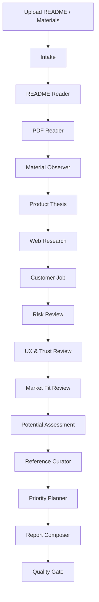

# Claude Code 架构学习与 Product Agent 升级方案

日期：2026-06-24

## 1. 学到的架构原则

Claude Code / Claude Agent SDK 的关键不是“模型更会思考”，而是给模型一个可控的运行架构：

- Built-in tools：读文件、搜索、抓网页、运行命令等能力必须是清晰工具。
- Subagents：复杂任务拆给独立上下文的专家，避免主上下文膨胀。
- Hooks：在工具调用前后做安全、日志、审计、拦截和补充上下文。
- Permissions：读、写、网络、执行命令要有边界。
- Sessions / checkpoints：长任务要可恢复、可追踪。
- Memory：稳定规则放进项目记忆，临时内容留在当前会话。

对 Product Agent 的启发：

> 不要做一个“上传 README -> 大 prompt 猜潜力”的黑盒工具，而要做一个有工具轨迹、证据边界和质量门禁的产品研究 Agent。

## 2. Product Agent 新架构

推荐路线：

> Deterministic Workflow + Product Research Agent + Tool Layer + Evidence Store + Quality Gate

MVP 仍然不引入复杂多 Agent runtime，但在代码层面保留 Claude Code 风格的边界：

- 材料读取工具：README / Markdown / TXT / PDF / 图片指标。
- Web 工具：抓取 README 中的公开 URL；配置搜索 API 后执行搜索。
- 研究状态：保存材料、网页证据、跳过原因和 agent trace。
- 报告 composer：只基于材料和网页证据生成判断。
- Quality gate：schema validation；后续可增加 evaluator repair。

## 3. 新用户流程

1. 用户上传 README.md、产品介绍 PDF 或页面材料。
2. Agent 读取 README，提取产品名、用户、用法、demo、官网、文档和链接。
3. Agent 抓取 README 里的公开 URL。
4. 如果配置 `SERPER_API_KEY`，Agent 搜索产品名、替代方案、竞品和评论。
5. Agent 判断：
   - 用户任务是否强。
   - 市场是否已有需求信号。
   - 替代方案是什么。
   - 产品是否有差异化 wedge。
   - 分发路径是否现实。
   - README 是否足够让用户相信并行动。
6. Agent 输出产品潜力分、潜力判断、市场证据、最大问题和下一步实验。

## 4. 可见 Workflow



## 5. 工具权限和安全

MVP 的网页抓取遵循保守边界：

- 只抓 `http/https`。
- 拒绝 localhost、127.0.0.1、0.0.0.0、内网 IP、`.local` 和 `.internal`。
- 每次最多抓取 5 个 README 链接。
- 每个网页有超时。
- 搜索 API 未配置时明确写入 trace，不伪造搜索结果。

## 6. 报告新增字段

```ts
type ProductDiagnosisReport = {
  diagnosis_score: number;
  potential_score: number;
  potential_verdict: string;
  first_impression: string;
  diagnosis_tags: string[];
  market_evidence: {
    signal: string;
    evidence: string;
    interpretation: string;
  }[];
  top_issues: ProductDiagnosisIssue[];
  references: ProductDiagnosisReference[];
  actionable_suggestions: string[];
  limitations: string[];
};
```

## 7. 后续增强

- 把 web research 拆成独立 subagent。
- 增加 evaluator model，对“潜力判断是否有证据支撑”做二次审查。
- 支持 GitHub repo URL 直接抓 README、stars、issues、release 活跃度。
- 支持 Product Hunt / Hacker News / Reddit 搜索。
- 为每次报告生成 evidence citations。
- 增加“下一步验证实验”专门模块，例如 landing page test、waitlist、冷启动私信脚本。

## 参考来源

- Claude Agent SDK overview: https://code.claude.com/docs/en/agent-sdk/overview
- Claude Code hooks: https://code.claude.com/docs/en/agent-sdk/hooks
- Claude Code memory: https://code.claude.com/docs/en/memory
- Claude Agent SDK subagents: https://code.claude.com/docs/en/agent-sdk/subagents
- Anthropic, Building Effective Agents: https://www.anthropic.com/engineering/building-effective-agents
- Anthropic, How we contain Claude across products: https://www.anthropic.com/engineering/how-we-contain-claude
