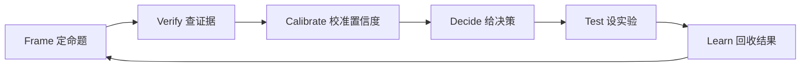
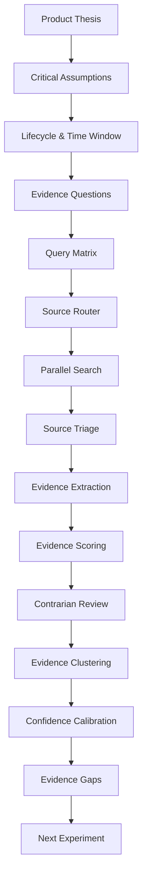

# Evidence Agent 证据调研系统 PRD

版本：v0.1  
日期：2026-06-25  
定位：Product Agent 的核心能力层。它不负责“写一段好听的产品点评”，而负责系统性查找市场证据、反证和证据缺口，从而提高“这个产品有没有潜力”的判断置信度。

## 1. 一句话目标

Evidence Agent 要回答：

> 这个产品的关键假设，有没有被公开市场信号支持？有没有强反证？现在的判断置信度是多少？下一步最小实验应该验证什么？

## 2. 为什么要单独做 Evidence Agent

Product Agent 的真正差异化不是“会分析”，而是“会查证”。

通用 GPT 的默认问题：

- 容易根据上传材料直接生成看似合理的判断。
- 容易把创始人自己的描述当成事实。
- 容易忽略替代方案、反证和低频需求。
- 容易给一个主观分数，但不说明证据强度。

Evidence Agent 的产品原则：

- 不把材料里的说法直接当成市场事实。
- 每个关键结论都要绑定 evidence cards。
- 同时找支持证据和反对证据。
- 潜力分和置信度分开。
- 把“证据缺口”转化成下一步验证实验。
- 严格区分观察事实、证据解释、模型推断和待验证假设。
- 每条证据都必须记录时效性；过期证据只能用于历史趋势，不能直接支撑当前判断。
- 报告不是终点，下一步实验结果要能回流并更新判断。
- 流程允许回退；如果证据推翻了原产品命题，必须回到 Product Thesis 重新 frame。

## 2.2 客观性协议

目标：减少 AI 主观判断，防止模型把“看起来合理”包装成“市场事实”。

Product Agent 的结论必须分四层：

| 层级 | 名称 | 定义 | 是否可支撑最终判断 |
| --- | --- | --- | --- |
| L1 | Observed Fact | 来源中可直接观察到的事实，例如价格、评论、用户原话、下载量、发布时间 | 可以 |
| L2 | Evidence Interpretation | 对 L1 事实的最小解释，例如“该评论说明用户在意准确性” | 可以，但必须绑定 L1 |
| L3 | Model Inference | 模型基于多条证据做出的推断，例如“目标用户可能是独立开发者” | 只能弱支撑 |
| L4 | Hypothesis | 尚未验证的判断，例如“用户愿意为诊断付费” | 不能支撑最终判断，只能进入下一步实验 |

硬规则：

- 没有 Evidence Card 的结论，不能进入 `strongestSupport` 或 `strongestOpposition`。
- L3 推断必须写出依据来源，且默认低置信。
- L4 假设必须进入 `evidenceGaps` 或 `recommendedExperiment`。
- 报告不允许使用“显然、一定、证明了、市场很大”这类绝对化表达，除非有强行为证据。
- 所有 verdict 都要附带 `whyNotHigher` 和 `whatWouldChangeMyMind`。

客观判断模板：

```text
基于 X 条当前证据、Y 条反证和 Z 个未验证假设，我们只能得出：
当前公开证据支持 [较弱/中等/较强] 的需求信号；
但 [付费/留存/分发/目标用户] 证据不足，因此置信度为 N。
```

## 2.3 产品判断闭环

Evidence Agent 的工作不是一次性输出报告，而是一个证据驱动循环：



每一轮循环只做一件事：

> 找到当前最大不确定性，并设计最低成本动作让它变得更确定。

核心状态：

- Frame：当前产品命题和目标用户是否清楚。
- Verify：当前证据是否覆盖关键假设。
- Calibrate：潜力判断的置信度有多高。
- Decide：继续做、先验证、重定位，还是停止。
- Test：下一步用什么实验拿到更强证据。
- Learn：实验结果如何更新 Claim Ledger。

## 2.4 Claim Ledger

Claim Ledger 是 Evidence Agent 的事实账本。报告里的每个判断都必须来自 Claim Ledger，而不是直接来自模型主观总结。

```ts
type ClaimLedger = {
  claims: ProductClaim[];
  lastUpdatedAt: string;
  overallConfidence: number;
  openQuestions: string[];
};

type ProductClaim = {
  id: string;
  text: string;
  claimType:
    | "target_user"
    | "problem"
    | "frequency"
    | "workaround"
    | "payment"
    | "distribution"
    | "ai_advantage"
    | "trust"
    | "timing"
    | "decision";
  objectiveLevel: "observed_fact" | "evidence_interpretation" | "model_inference" | "hypothesis";
  status: "supported" | "opposed" | "mixed" | "unverified" | "stale";
  supportEvidenceIds: string[];
  opposeEvidenceIds: string[];
  confidence: number;
  temporalValidityScore: number;
  whyItMatters: string;
  whatWouldChangeThisClaim: string[];
};
```

硬规则：

- Product Diagnosis Report 只能摘要 Claim Ledger。
- 如果 claim 没有 supportEvidenceIds，也没有 opposeEvidenceIds，只能标记为 `unverified`。
- 如果 claim 的主要证据过期，status 必须变成 `stale`。
- 如果查证据后发现 target_user 或 core_job 错了，流程必须回退到 Frame。

## 2.5 Evidence Stop Rule

有些情况下，Agent 必须停止强判断，输出“无法高置信判断”。

Stop Rule：

- 关键假设覆盖少于 3 个。
- 有效 Evidence Cards 少于 8 张。
- 反证卡少于 2 张。
- 当前证据少于 3 条，且产品属于 very_high time sensitivity。
- objectiveEvidenceRatio 低于 0.5。
- unknown_recency 证据超过 40%。
- 目标用户和用户任务都来自模型推断，而不是材料或外部证据。

Stop Rule 输出：

```ts
type EvidenceStop = {
  stopped: true;
  reason: string;
  blockedDecision: "build" | "stop" | "reposition";
  allowedDecision: "test_first";
  minimumEvidenceNeeded: string[];
  recommendedExperiment: ValidationExperiment;
};
```

产品原则：

- 停止强判断不是失败，而是可信度设计。
- 当 Stop Rule 触发时，报告仍然可以输出，但 verdict 必须是 `insufficient` 或 `test_first`。

## 3. 参考方法

本 PRD 吸收以下方法：

- Strategyzer Testing Business Ideas：先拆假设，再选择合适实验；证据强度取决于离真实购买行为有多近。
- Lean Startup：MVP 的目的不是做小产品，而是用最小努力获得最大 validated learning。
- Superhuman PMF Engine：用明确指标追踪产品市场匹配，例如用户无法使用产品时是否会非常失望。
- Opportunity Solution Tree：从 outcome、opportunity、solution、assumption test 逐层拆解，而不是直接跳到方案。

参考链接：

- https://www.strategyzer.com/library/how-strong-is-your-innovation-evidence
- https://www.strategyzer.com/library/testing-business-ideas-book-summary
- https://theleanstartup.com/principles
- https://review.firstround.com/how-superhuman-built-an-engine-to-find-product-market-fit/
- https://www.producttalk.org/opportunity-solution-trees/

## 4. 核心输出

Evidence Agent 最终输出不是“网页搜索摘要”，而是一个 Evidence Brief：

```ts
type EvidenceBrief = {
  productName: string;
  productLifecycleStage: ProductLifecycleStage;
  claimLedger: ClaimLedger;
  evidenceStop?: EvidenceStop;
  evidenceVerdict: "strong_support" | "weak_support" | "mixed" | "weak_opposition" | "strong_opposition" | "insufficient";
  confidenceScore: number;
  supportScore: number;
  oppositionScore: number;
  sourceDiversityScore: number;
  behaviorStrengthScore: number;
  recencyScore: number;
  temporalValidityScore: number;
  currentEvidenceRatio: number;
  staleEvidenceCount: number;
  assumptionCoverageScore: number;
  keyEvidenceClusters: EvidenceCluster[];
  strongestSupport: EvidenceCard[];
  strongestOpposition: EvidenceCard[];
  evidenceGaps: EvidenceGap[];
  decision: ProductDecision;
  recommendedExperiment: ValidationExperiment;
};
```

## 5. 总流程



中文流程：

> 产品命题 -> 关键假设 -> 生命周期与时间窗口 -> 证据问题 -> 查询矩阵 -> 来源路由 -> 并行搜索 -> 来源筛选 -> 证据抽取 -> 证据打分 -> 反证审查 -> 证据聚类 -> 置信度校准 -> 证据缺口 -> 下一步实验

## 6. 阶段 0：输入归一化

目标：把 Product Agent 前面阶段抽取出的产品信息变成证据调研输入。

输入：

- product_summary
- target_user
- core_job
- current_alternative
- value_proposition
- business_model
- distribution_guess
- critical_assumptions

局部最优解：

- 如果目标用户不清楚，不直接搜产品名，而是先生成 2-3 个可能的用户画像。
- 如果用户任务不清楚，先把功能翻译成 Jobs-to-be-Done。
- 如果产品名太泛，避免产品名搜索污染，优先搜索痛点、替代方案和使用场景。

输出：

```ts
type EvidenceInput = {
  productName?: string;
  targetUsers: TargetUserCandidate[];
  customerJobs: CustomerJobCandidate[];
  alternatives: AlternativeCandidate[];
  criticalAssumptions: CriticalAssumption[];
  marketCategoryGuesses: string[];
  searchLanguageHints: ("en" | "zh" | "mixed")[];
};
```

质量门槛：

- targetUsers 至少 1 个。
- customerJobs 至少 1 个。
- criticalAssumptions 至少 3 个。
- 如果缺失，Evidence Agent 必须标记 `insufficient_input`，不要假装能高置信判断。

## 7. 阶段 1：关键假设优先级排序

目标：不是验证所有事情，而是先验证“错了产品就不成立”的假设。

假设类型：

```ts
type AssumptionType =
  | "user"
  | "problem"
  | "frequency"
  | "workaround"
  | "payment"
  | "alternative_gap"
  | "distribution"
  | "ai_advantage"
  | "trust"
  | "timing";
```

优先级计算：

```ts
riskPriority = importance * uncertainty * reversibilityPenalty
```

解释：

- importance：这个假设对产品成立有多关键。
- uncertainty：目前材料里有多少不确定性。
- reversibilityPenalty：如果现在做错，后续是否很难改。

局部最优解：

- P0 只验证前 5 个假设。
- 每个假设必须有“支持证据需求”和“反证证据需求”。
- 低优先级假设只记录，不进入深搜。

输出：

```ts
type PrioritizedAssumption = {
  id: string;
  statement: string;
  type: AssumptionType;
  importance: number;
  uncertainty: number;
  reversibilityPenalty: number;
  riskPriority: number;
  whatWouldSupportIt: string[];
  whatWouldDisproveIt: string[];
};
```

## 8. 阶段 2：生命周期与时间窗口

目标：判断这个产品处在什么生命周期阶段，并为证据设置合适的时效性规则。

为什么重要：

- 一个 2023 年的 AI 写作工具好评，不能直接证明 2026 年仍有强需求。
- 一个成熟 B2B 工作流的 2 年前证据可能仍有价值，因为流程变化慢。
- 一个刚爆发的平台机会，3 个月前的证据可能已经过期。
- 早期产品更看重探索性需求证据，成熟产品更看重留存、付费和迁移成本。

产品生命周期：

```ts
type ProductLifecycleStage =
  | "idea"
  | "prototype"
  | "mvp"
  | "launch"
  | "early_traction"
  | "growth"
  | "mature"
  | "decline"
  | "unknown";
```

市场生命周期：

```ts
type MarketLifecycleStage =
  | "emerging"
  | "hype"
  | "early_adoption"
  | "consolidation"
  | "mature"
  | "declining"
  | "unknown";
```

产品类别时间敏感度：

```ts
type TimeSensitivity =
  | "very_high" // AI 工具、平台生态、社媒增长、消费趋势
  | "high"      // 开发者工具、营销工具、创作者工具
  | "medium"    // B2B SaaS、协作工具、运营流程
  | "low";      // 合规、财务、传统企业流程、长期基础设施
```

默认新鲜度窗口：

| 类别 | Fresh | Usable | Historical | 说明 |
| --- | --- | --- | --- | --- |
| AI/平台/社媒趋势 | 0-90 天 | 90-365 天 | 365 天以上 | 技术和渠道变化快，旧证据快速衰减 |
| 开发者/创作者工具 | 0-180 天 | 180-540 天 | 540 天以上 | 工具链变化较快，但工作流有延续性 |
| B2B SaaS/运营流程 | 0-365 天 | 1-3 年 | 3 年以上 | 业务流程较稳定，旧证据仍可参考 |
| 传统企业/合规/财务 | 0-540 天 | 1.5-4 年 | 4 年以上 | 需求变化慢，但法规和采购周期要单独检查 |

输出：

```ts
type TemporalContext = {
  productLifecycleStage: ProductLifecycleStage;
  marketLifecycleStage: MarketLifecycleStage;
  timeSensitivity: TimeSensitivity;
  freshWindowDays: number;
  usableWindowDays: number;
  historicalWindowDays: number;
  currentDate: string;
  timeCriticalReasons: string[];
};
```

局部最优解：

- 先判断时间敏感度，再判断证据新鲜度。
- 缺少日期的证据默认 `unknown_recency`，不能作为强证据。
- 旧证据可以证明“历史上有人需要过”，但不能证明“现在仍然有需求”。
- 如果市场处在 hype 阶段，必须额外查找“退潮证据”：降温、差评、预算收缩、平台政策变化、竞品关闭。

## 9. 阶段 3：Evidence Questions 生成

目标：把每个假设变成可搜索、可验证的问题。

每个假设至少生成 5 类问题：

1. 痛点问题：有没有人明确表达这个问题？
2. 行为问题：有没有人已经在用替代方案解决？
3. 付费问题：有没有人为解决方案付费？
4. 竞品问题：有没有类似产品、服务、模板、外包？
5. 反证问题：有没有证据说明问题低频、无价值、难分发或已被免费方案解决？

示例：

假设：

> 独立开发者需要在发布前判断 AI 产品有没有潜力。

Evidence Questions：

- 独立开发者是否公开抱怨“不知道产品有没有市场”？
- 他们现在是否用顾问、社群、朋友、投资人、Twitter 反馈来判断？
- 是否有人为产品诊断、landing page audit、startup idea validation 付费？
- 竞品是否存在？价格多少？评论如何？
- 有没有人认为这类分析无法自动化，必须靠真实用户访谈？

输出：

```ts
type EvidenceQuestion = {
  id: string;
  assumptionId: string;
  question: string;
  evidenceNeed: "pain" | "behavior" | "payment" | "competitor" | "opposition";
  idealSourceTypes: SourceType[];
  minimumUsefulEvidence: string;
};
```

局部最优解：

- 不生成抽象问题，例如“市场是否大”。
- 必须生成可搜索的问题，例如“谁在抱怨、用什么替代、是否付费、哪里有差评”。

## 10. 阶段 4：查询矩阵生成

目标：为每个 Evidence Question 生成多角度查询，覆盖支持和反证。

查询模板：

### 9.1 痛点查询

- `"{target_user}" "struggling with" "{problem}"`
- `"{target_user}" "how do I" "{job}"`
- `"I hate" "{current_workaround}"`
- `"{problem}" "takes too much time"`
- `"{problem}" "manual process"`

### 9.2 替代方案查询

- `"{job}" template`
- `"{job}" spreadsheet`
- `"{job}" Notion`
- `"{job}" Zapier`
- `"{job}" consultant`
- `"{job}" agency`

### 9.3 竞品查询

- `"best tools for" "{job}"`
- `"{job}" software`
- `"{problem}" SaaS`
- `"{competitor_guess}" alternative`
- `site:producthunt.com "{job}"`
- `site:g2.com "{category}"`

### 9.4 付费查询

- `"{job}" pricing`
- `"{problem}" service pricing`
- `"{job}" audit service`
- `"{job}" freelancer`
- `site:upwork.com "{job}"`
- `site:fiverr.com "{job}"`

### 9.5 反证查询

- `"{problem}" "not worth it"`
- `"{category}" failed startup`
- `"{competitor}" bad reviews`
- `"{problem}" "free tool"`
- `"{job}" "too expensive"`
- `"{ai_solution}" accuracy problem`

### 9.6 中文查询

- `"{目标用户}" "{痛点}" 怎么办`
- `"{任务}" 工具`
- `"{任务}" 模板`
- `"{竞品}" 替代`
- `"{痛点}" 太麻烦`
- `"{产品类别}" 失败`

输出：

```ts
type SearchQuery = {
  id: string;
  evidenceQuestionId: string;
  query: string;
  language: "en" | "zh";
  intent: "pain" | "workaround" | "competitor" | "payment" | "opposition";
  sourceHint?: SourceType;
  priority: number;
};
```

局部最优解：

- 每个高优先级假设生成 20-40 个查询。
- 查询必须覆盖至少 1 个反证方向。
- 同义词要展开，但不能无限扩展。P0 每次总查询上限 80。

## 11. 阶段 5：来源路由

目标：不同问题去不同地方找证据。

```ts
type SourceType =
  | "open_web"
  | "forum"
  | "reddit"
  | "hacker_news"
  | "github"
  | "stackoverflow"
  | "product_hunt"
  | "g2"
  | "capterra"
  | "app_store"
  | "chrome_store"
  | "youtube"
  | "blog"
  | "pricing_page"
  | "job_board"
  | "freelance_marketplace"
  | "social"
  | "search_trend"
  | "academic"
  | "news";
```

来源与问题匹配：

| 问题 | 优先来源 |
| --- | --- |
| 用户是否痛 | Reddit、HN、论坛、社媒、博客 |
| 是否有 workaround | GitHub、博客、YouTube、模板站、Notion/Excel 资源 |
| 是否愿意付费 | Pricing page、G2、Capterra、服务商、Upwork、Fiverr |
| 竞品如何 | 官网、Product Hunt、G2、Chrome Store、App Store |
| 分发是否可行 | 社媒、论坛、newsletter、SEO 搜索结果 |
| 是否有反证 | 差评、失败案例、低分评论、免费替代、投诉 |

局部最优解：

- P0 使用通用搜索 API + 网页抓取模拟多来源。
- P1 接入垂直来源 API 或定向站内搜索。
- P2 建立可复用 source adapters。

## 12. 阶段 6：并行搜索执行

目标：用 agent 能力大量调研，但控制成本和噪音。

执行策略：

```ts
type SearchPlan = {
  maxQueries: number;
  maxResultsPerQuery: number;
  maxPagesToFetch: number;
  concurrency: number;
  timeoutMs: number;
  dedupeByDomain: boolean;
  requireOppositionSearch: boolean;
};
```

P0 建议：

- maxQueries：40
- maxResultsPerQuery：5
- maxPagesToFetch：30
- concurrency：4
- timeoutMs：120000
- requireOppositionSearch：true

P1 建议：

- maxQueries：80
- maxResultsPerQuery：10
- maxPagesToFetch：80
- concurrency：8
- 加入 source adapters 和缓存。

局部最优解：

- 搜索多，但不要全读。先 triage，再抓取。
- 对同域名结果去重，避免某个 SEO 站污染。
- 必须保留搜索失败、跳过、无结果的 trace。

## 13. 阶段 7：Source Triage

目标：从大量结果里筛出值得抓取和抽取的页面。

筛选维度：

```ts
type SourceTriageScore = {
  targetUserMatch: number;
  problemMatch: number;
  behaviorSignalLikelihood: number;
  sourceCredibility: number;
  recency: number;
  commercialSignal: number;
  oppositionPotential: number;
  spamRisk: number;
  finalScore: number;
};
```

保留规则：

- finalScore >= 0.62：抓取正文。
- 0.45 <= finalScore < 0.62：保留 snippet，不抓全文。
- finalScore < 0.45：丢弃，但记录原因。

高优先级页面：

- 用户原话、评论、review、issue。
- 价格页、付费服务页。
- 竞品官网、对比页、替代页。
- 失败案例、负面评论。

低优先级页面：

- 泛泛趋势文章。
- SEO 内容农场。
- 没有具体用户或行为的列表文章。
- 明显由 AI 生成的浅内容。

局部最优解：

- 不追求“多链接”，追求“每条链接能证明什么”。
- 每个假设至少保留 2 条候选支持证据和 1 条候选反证。

## 14. 阶段 8：Evidence Card 抽取

目标：把网页内容变成可审核的证据卡。

```ts
type EvidenceCard = {
  id: string;
  assumptionId: string;
  evidenceQuestionId: string;
  sourceTitle: string;
  sourceUrl: string;
  sourceType: SourceType;
  publishedAt?: string;
  updatedAt?: string;
  observedAt?: string;
  capturedAt: string;
  evidenceAgeDays?: number;
  recencyBucket: "fresh" | "usable" | "historical" | "unknown_recency";
  recencyWeight: number;
  lifecycleStageAtEvidence?: MarketLifecycleStage;
  lifecycleRelevance: number;
  objectiveLevel: "observed_fact" | "evidence_interpretation" | "model_inference" | "hypothesis";
  claim: string;
  targetUser: string;
  signalType:
    | "claim"
    | "complaint"
    | "workaround"
    | "comparison"
    | "pricing"
    | "purchase_intent"
    | "usage"
    | "retention"
    | "churn"
    | "negative_review"
    | "failure_case";
  direction: "support" | "oppose" | "neutral";
  behaviorStrength: 1 | 2 | 3 | 4 | 5 | 6 | 7;
  relevanceScore: number;
  credibilityScore: number;
  recencyScore: number;
  quoteOrSnippet: string;
  interpretation: string;
  caveat: string;
  confidence: number;
};
```

Evidence Card 规则：

- 一张卡只证明一个 claim。
- 必须记录 sourceUrl。
- 必须尽量记录 publishedAt、updatedAt 或 observedAt。
- 无法确认日期的证据标记为 `unknown_recency`，强度上限为 3。
- quoteOrSnippet 只保留短摘录或摘要，避免长引用。
- interpretation 必须说明“为什么这条证据支持或反对某个假设”。
- caveat 必须说明证据局限。
- objectiveLevel 必须明确标注，默认不能把 model_inference 当成 observed_fact。

局部最优解：

- 不允许“因为这篇文章说市场很大，所以产品有潜力”这种跳跃。
- 必须把证据绑定到具体假设。
- 不允许用过期证据支撑当前强结论，只能用于历史趋势或生命周期判断。

## 15. 阶段 9：证据强度分级

目标：让用户明白为什么有些证据更可信。

证据强度 7 级：

| 等级 | 证据类型 | 示例 | 权重 |
| --- | --- | --- | --- |
| 1 | 创始人自述 | README 声称用户需要 | 0.10 |
| 2 | 行业趋势 | 市场报告、趋势文章 | 0.20 |
| 3 | 公开抱怨 | 用户在论坛抱怨问题 | 0.35 |
| 4 | Workaround | 用户用表格、脚本、人工流程解决 | 0.50 |
| 5 | 付费替代 | 竞品收费、服务商收费、外包市场存在 | 0.65 |
| 6 | 真实评价 | 竞品有评论、差评、复购迹象 | 0.78 |
| 7 | 真实转化 | 留邮箱、预约、付款、留存、PMF survey | 0.95 |

局部最优解：

- 趋势文章不能把潜力分推高太多。
- 用户行为证据优先于专家观点。
- 反证如果是行为证据，权重同样很高。

## 15.1 证据时效评分

目标：同样强度的证据，会因为产品类别、市场生命周期和发布时间不同而有不同有效性。

时效权重：

```ts
type RecencyBucket = "fresh" | "usable" | "historical" | "unknown_recency";

function recencyWeight(bucket: RecencyBucket) {
  if (bucket === "fresh") return 1.0;
  if (bucket === "usable") return 0.65;
  if (bucket === "historical") return 0.30;
  return 0.20;
}
```

组合权重：

```ts
effectiveEvidenceWeight =
  behaviorStrengthWeight *
  relevanceScore *
  credibilityScore *
  recencyWeight *
  lifecycleRelevance
```

时效规则：

- `fresh` 证据可以支撑当前判断。
- `usable` 证据可以支撑趋势判断，但需要当前证据补强。
- `historical` 证据只能说明历史需求或历史失败原因，不能单独支撑当前机会。
- `unknown_recency` 证据默认不进入 strongestSupport，除非它是低变化领域的基础事实。
- 对 very_high time sensitivity 产品，`historical` 支持证据不能把 confidenceScore 推高超过 50。
- 对反证，旧证据仍然重要：如果历史上多个同类产品失败，需要查是否已有新条件改变失败原因。

生命周期适用性：

| 产品阶段 | 更重要的证据 | 弱化的证据 |
| --- | --- | --- |
| idea / prototype | 痛点、workaround、目标用户、可触达渠道 | 老竞品规模、泛市场报告 |
| mvp / launch | 点击、留邮箱、访谈、社区反馈、首批竞品评价 | 长期留存、规模化收入 |
| early_traction | 留存、复用、付费、PMF survey、渠道转化 | 创始人愿景、趋势叙事 |
| growth / mature | churn、NPS、竞品迁移、单客价值、销售周期 | 早期兴趣、泛讨论热度 |
| decline | 流失、替代品迁移、价格压力、搜索下降 | 历史增长、旧好评 |

局部最优解：

- Evidence Agent 先问“这条证据对当前生命周期是否仍然有效”，再问“它支持什么结论”。
- 生命周期不匹配的证据必须降权。
- 如果一个产品处于早期，但只有成熟竞品的证据，结论应当是“市场存在，但 wedge 未被证明”。

## 16. 阶段 10：Contrarian Review 反证审查

目标：主动找“这个产品可能不成立”的证据。

反证维度：

- 低频：问题发生太少。
- 低痛：问题烦，但不值得付费。
- 免费替代：免费工具已经够用。
- 拥挤：竞品多且差异化弱。
- 信任：AI 输出不能被信任，用户不敢用。
- 分发：目标用户难触达。
- 预算：用户不是预算拥有者。
- Timing：市场热但用户还没准备好。
- Feature risk：这是一个功能，不是公司。

输出：

```ts
type ContrarianReview = {
  strongestOpposingClaim: string;
  opposingEvidence: EvidenceCard[];
  unresolvedRisks: string[];
  whatWouldChangeMyMind: string[];
};
```

局部最优解：

- 每份报告必须有“最强反证”。
- 如果没有找到反证，不能说没有风险，只能说“反证覆盖不足”。
- 反证要进入置信度计算。

## 17. 阶段 11：证据聚类

目标：把大量证据变成可读、可决策的 clusters。

```ts
type EvidenceCluster = {
  id: string;
  title: string;
  clusterType:
    | "pain_signal"
    | "workaround_signal"
    | "payment_signal"
    | "competitor_signal"
    | "distribution_signal"
    | "ai_advantage_signal"
    | "opposition_signal"
    | "missing_signal";
  summary: string;
  supportCards: EvidenceCard[];
  opposeCards: EvidenceCard[];
  netStrength: number;
  confidence: number;
};
```

默认 clusters：

- 痛点信号
- 替代方案信号
- 付费信号
- 竞品信号
- 分发信号
- AI 优势信号
- 反证信号
- 缺失信号

局部最优解：

- 前端展示 clusters，不展示海量原始搜索结果。
- 用户可以展开看到 evidence cards。
- 每个 cluster 都要有一句“这对产品潜力意味着什么”。

## 18. 阶段 12：置信度校准

目标：把证据状况变成可解释的 confidence score。

```ts
confidenceScore =
  assumptionCoverageScore * 0.18 +
  sourceDiversityScore * 0.12 +
  behaviorStrengthScore * 0.20 +
  objectiveEvidenceRatio * 0.14 +
  temporalValidityScore * 0.14 +
  supportOppositionBalanceScore * 0.10 +
  targetUserMatchScore * 0.08 +
  evidenceConsistencyScore * 0.04
```

各项含义：

- assumptionCoverageScore：关键假设是否都被查过。
- sourceDiversityScore：来源是否足够多样。
- behaviorStrengthScore：是否有真实行为/付费证据。
- objectiveEvidenceRatio：Observed Fact 和 Evidence Interpretation 占比，越少主观推断越高。
- temporalValidityScore：证据是否足够新，且是否适配当前产品生命周期。
- supportOppositionBalanceScore：支持和反证是否都覆盖。
- targetUserMatchScore：证据里的用户是否匹配目标用户。
- evidenceConsistencyScore：证据之间是否互相矛盾。

输出：

```ts
type ConfidenceCalibration = {
  confidenceScore: number;
  confidenceLabel: "very_low" | "low" | "medium" | "high";
  objectiveEvidenceRatio: number;
  temporalValidityScore: number;
  staleEvidenceCount: number;
  unknownRecencyEvidenceCount: number;
  whyNotHigher: string[];
  whyNotLower: string[];
};
```

局部最优解：

- 没有付费/行为证据时，confidenceScore 默认不超过 60。
- 只看上传材料时，confidenceScore 默认不超过 35。
- 只有趋势文章时，confidenceScore 默认不超过 45。
- 当前证据少于 3 条时，confidenceScore 默认不超过 50。
- `unknown_recency` 证据超过 40% 时，confidenceScore 默认不超过 55。
- 对 very_high time sensitivity 产品，fresh 证据少于 2 条时，confidenceScore 默认不超过 55。
- objectiveEvidenceRatio 低于 0.5 时，confidenceScore 默认不超过 60。
- 同时有强支持和强反证时，verdict 应该是 mixed，而不是简单平均。

## 19. 阶段 13：证据缺口与下一步实验

目标：把“还不确定”变成最小验证动作。

```ts
type EvidenceGap = {
  assumptionId: string;
  missingEvidence: string;
  whyItMatters: string;
  recommendedExperimentType:
    | "customer_interview"
    | "landing_page_smoke_test"
    | "fake_door"
    | "pricing_test"
    | "cold_email"
    | "community_post"
    | "concierge_mvp"
    | "pmf_survey";
  expectedConfidenceGain: number;
};
```

实验选择规则：

| 最大缺口 | 推荐实验 |
| --- | --- |
| 不知道谁痛 | 10 个 story-based customer interviews |
| 不知道是否有兴趣 | Landing page smoke test |
| 不知道是否愿意付费 | Pricing page / fake-door checkout |
| 不知道分发是否成立 | 3 个渠道发帖测试点击 |
| 不知道能否交付价值 | Concierge MVP |
| 已有用户但不知 PMF | Sean Ellis PMF survey |

局部最优解：

- 每次只推荐 1 个主实验。
- 必须有成功标准和失败标准。
- 不能推荐“继续调研”这种模糊动作。

输出：

```ts
type ValidationExperiment = {
  title: string;
  hypothesis: string;
  targetUser: string;
  channel: string;
  steps: string[];
  successMetric: string;
  failureMetric: string;
  sampleSize: string;
  timeRequired: string;
  costLevel: "free" | "low" | "medium" | "high";
  expectedConfidenceGain: number;
};
```

## 19.1 决策类型

目标：避免报告只给“好/不好”，而是给当前证据下最合理的下一步。

```ts
type ProductDecision = {
  decision: "build" | "test_first" | "reposition" | "stop";
  confidence: number;
  rationaleClaimIds: string[];
  strongestReason: string;
  strongestCounterReason: string;
  nextMilestone: string;
};
```

决策规则：

| 决策 | 条件 |
| --- | --- |
| build | 强行为/付费证据存在，关键反证未击穿，置信度高 |
| test_first | 有需求迹象但证据缺口明显，早期产品默认走这里 |
| reposition | 证据支持问题存在，但目标用户、场景或 wedge 错了 |
| stop | 关键假设被强反证击穿，且没有合理重定位路径 |

局部最优解：

- 早期产品默认不是 build，而是 test_first。
- build 需要强证据，不需要模型乐观。
- stop 也需要强反证，不能因为证据不足就建议停止。

## 19.2 实验结果回流

目标：让用户做完实验后，Product Agent 能更新判断，而不是每次重新分析。

```ts
type ExperimentResult = {
  experimentId: string;
  completedAt: string;
  resultType: "success" | "failure" | "inconclusive";
  observedMetrics: {
    name: string;
    value: number | string;
    target?: number | string;
  }[];
  qualitativeNotes: string[];
  newEvidenceCards: EvidenceCard[];
  claimUpdates: {
    claimId: string;
    previousStatus: ProductClaim["status"];
    nextStatus: ProductClaim["status"];
    confidenceDelta: number;
    reason: string;
  }[];
};
```

回流规则：

- 实验结果必须变成新的 Evidence Cards。
- 成功实验不自动等于产品有潜力，只更新对应假设。
- 失败实验不自动等于产品没潜力，先判断是用户错、渠道错、文案错，还是需求错。
- 每次回流后重新计算 Claim Ledger、confidenceScore 和 decision。

局部最优解：

- 产品应该支持用户点击“我完成了这个实验”，填入结果。
- 下一份报告应显示“判断相比上一轮如何变化”。

## 20. 前端：Evidence Room

Evidence Room 是 Product Agent 报告前的可见研究室。

### 19.1 Live State

运行中展示：

- 正在拆解关键假设
- 已生成 42 个搜索查询
- 正在扫描 120 条结果
- 已保留 28 条候选来源
- 已抽取 14 张证据卡
- 已找到 6 条支持证据
- 已找到 4 条反证
- 最大缺口：缺付费行为证据

### 19.2 报告页展示

Evidence Room 包含：

1. Evidence Verdict
2. Confidence Score
3. Temporal Validity
4. Objective Evidence Ratio
5. Evidence Clusters
6. Strongest Support
7. Strongest Opposition
8. Evidence Gaps
9. Next Experiment
10. Raw Trace

### 19.3 UX 原则

- 默认展示结论和 clusters。
- 用户可展开查看 evidence cards。
- 每条 evidence card 有来源、信号类型、强度、解释、局限。
- 每条 evidence card 必须展示时间标签：fresh / usable / historical / unknown。
- 每条 evidence card 必须展示客观层级：事实 / 解释 / 推断 / 假设。
- 如果结论主要来自历史证据，前端必须显示“当前证据不足”。
- 不展示隐藏 chain-of-thought。
- 展示的是可观测研究过程和证据结构。

## 21. Tool Use 设计

P0 工具：

```ts
type EvidenceTool =
  | "generate_evidence_questions"
  | "generate_query_matrix"
  | "web_search"
  | "fetch_page"
  | "triage_sources"
  | "extract_evidence_cards"
  | "score_evidence_cards"
  | "run_contrarian_review"
  | "cluster_evidence"
  | "calibrate_confidence"
  | "design_validation_experiment";
```

每次工具调用必须记录：

```ts
type EvidenceToolCall = {
  id: string;
  toolName: EvidenceTool;
  status: "completed" | "failed" | "skipped";
  inputSummary: string;
  outputSummary: string;
  latencyMs: number;
  costEstimate?: number;
  sourceCount?: number;
  evidenceCardCount?: number;
};
```

## 22. MVP 实现路径

### P0：低成本版本

能力：

- 使用 Serper 做通用搜索。
- 抓取前 20-30 个页面。
- 使用 LLM 抽取 Evidence Cards。
- 生成 clusters、confidence、next experiment。
- 前端展示 Evidence Room 摘要。

限制：

- 不能保证覆盖所有垂直来源。
- 不能访问登录墙后的评论。
- 不做关键词搜索量真实 API。
- 不做社媒实时抓取。

但 P0 可以验证：

- 用户是否愿意等待更深度调研。
- 用户是否信任证据卡。
- 用户是否觉得“反证”和“置信度”有价值。

### P1：垂直来源增强

新增：

- Reddit/HN 定向搜索。
- GitHub issue/search。
- Product Hunt / G2 / Capterra 定向抓取。
- YouTube 搜索。
- Upwork/Fiverr/服务商搜索。
- URL 去重和缓存。
- source credibility scoring。

### P2：Research Swarm

新增子 agent：

- Pain Signal Agent
- Competitor Agent
- Payment Signal Agent
- Distribution Agent
- Contrarian Agent
- Experiment Designer Agent

Orchestrator 负责合并证据、去重、校准置信度。

## 23. 质量门槛

一份 Evidence Brief 合格标准：

- 至少覆盖前 3 个关键假设。
- 至少有 8 张有效 evidence cards。
- 至少 2 张反证卡。
- 至少 3 种 source types。
- 每个结论能回链到 evidence card。
- 明确说明 why confidence is not higher。
- 给出一个带成功/失败标准的实验。

高质量标准：

- 至少覆盖前 5 个关键假设。
- 至少 20 张有效 evidence cards。
- 至少 5 张反证卡。
- 至少 5 种 source types。
- 至少 1 条付费或强行为证据。
- 能指出一个非常具体的目标用户 segment。

## 24. 风险与防护

### 23.1 SEO 噪音

风险：搜索结果被 SEO 列表文章污染。  
防护：降低泛文章权重，提高用户评论、价格页、review、issue 权重。

### 23.2 证据误读

风险：LLM 把相邻领域证据误判为目标用户证据。  
防护：每张卡都有 targetUserMatch 和 caveat。

### 23.3 只找支持证据

风险：报告变成确认偏误。  
防护：Contrarian Review 必跑；没有反证时标记 coverage gap。

### 23.4 置信度虚高

风险：链接很多但行为证据弱。  
防护：没有行为/付费证据时 confidence cap。

### 23.5 成本过高

风险：大量搜索和抓取导致慢且贵。  
防护：P0 查询上限、页面上限、缓存、先 triage 后抓取。

## 25. 产品文案建议

首页一句话：

> 上传产品材料，我会查找市场证据和反证，判断潜力与置信度，并给你下一步验证实验。

运行中文案：

> 我正在把产品命题拆成可验证假设，并查找公开市场信号。

Evidence Room 标题：

> 证据室

Evidence Room 副标题：

> 支持证据、反证和证据缺口都会展示。这里不是隐藏思维链，而是可审计的研究过程。

置信度解释：

> 置信度不是模型自信程度，而是当前证据对判断的支撑强度。

## 26. 下一步讨论重点

需要我们继续细化的决策：

1. P0 搜索深度：40 query / 30 page 是否够。
2. Evidence Card 是否默认展示原文摘录，还是只展示摘要和来源。
3. 置信度公式是否先用 rule-based，还是 LLM judge + rule cap。
4. 前端 Evidence Room 是报告页模块，还是分析过程中实时页面。
5. P0 是否必须接 Serper，否则只做 README URL 调研。
6. 是否为每个用户生成可分享的 Evidence Brief。
7. 是否允许用户点击“继续深挖这个假设”，追加调研。
