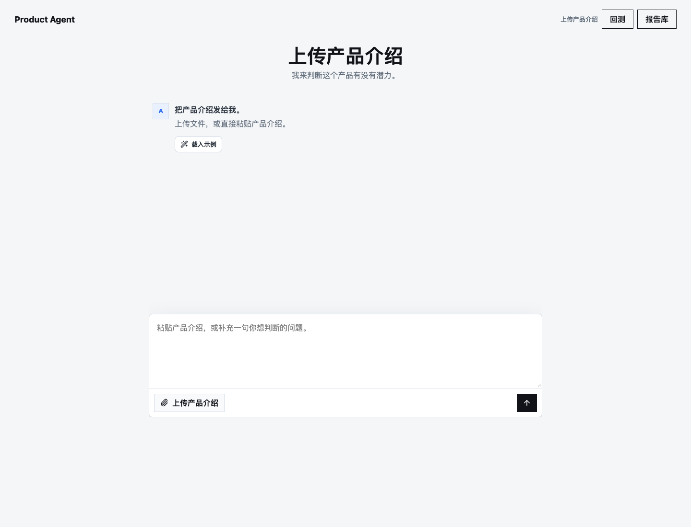

# Product Agent

Product Agent 是一个本地优先的产品分析 Agent：上传产品介绍后，它会读取材料、搜索证据、判断产品潜力，并生成带证据边界的报告。



## Local Beta v0.1

这一阶段默认不需要数据库和服务器，适合先让朋友、本地用户或 GitHub 访客 clone 后试用。设计参考了优秀开发者工具的首次使用体验：启动路径要短、状态要可见、示例要能马上跑。

快速启动：

```bash
pnpm install --registry=https://registry.npmmirror.com
pnpm local
```

访问：

- http://127.0.0.1:3020

打开首页后会看到 Local Beta 状态面板，里面会展示 `pnpm doctor` 的结果，包括依赖、环境变量、Docker、worker daemon 和 durable queue。没有 blocker 时可以直接上传或粘贴产品介绍开始分析。

第一次试用可以点击首页对话里的 `载入示例`。它会填入 `examples/local-beta-demo` 的 SignalShelf 样例材料，包括产品 README、访谈记录和早期渠道数据，适合快速生成第一份报告。

试用后欢迎直接在 [Local Beta feedback thread](https://github.com/ljunnan24-hash/Product-Agent/issues/1) 留言。短评论就可以；如果方便，最好带上：分析的产品类型、demo 是否跑通、自己的材料是否跑通、卡住的步骤、报告里最有用或最没用的一点，以及本地环境。

这版包含：

- 单入口产品分析：材料读取、网页证据、Judge、报告和质量审计。
- 本地 durable queue / replay / worker drain。
- Local Beta 状态面板和 `pnpm doctor` 环境体检。
- 受限代码执行，生产/强隔离模式只允许 Docker no-network。
- Memory v1 和局部刷新 v2。
- 内置 Demo 样例包。

常见状态：

- `0 阻塞`：本地环境可以跑。
- `有提醒`：可以跑，但搜索 key、Docker 或历史 worker 状态可能影响完整体验。
- `有阻塞`：先按面板或 `pnpm doctor` 输出处理。

环境变量：

```bash
REPORT_MODEL_PROVIDER=auto # 可选：auto / zhipu / deepseek；auto 默认优先使用 ZHIPU_API_KEY
ZHIPU_MODEL=glm-5.2 # 可选；用于读材料和生成报告
DEEPSEEK_API_KEY=...
DEEPSEEK_MODEL=deepseek-v4-flash
SEARCH_PROVIDER=zhipu # 可选：zhipu / serper；默认优先使用 ZHIPU_API_KEY
ZHIPU_API_KEY=... # 可选；用于智谱 Web Search
ZHIPU_SEARCH_ENGINE=search_std # 可选：search_std / search_pro
ZHIPU_CONTENT_SIZE=medium # 可选：medium / high
SERPER_API_KEY=... # 可选；用于 Serper Web Search
CODE_EXECUTOR_SANDBOX=auto # 可选：auto / process / docker；生产模式只允许 docker
CODE_EXECUTOR_DOCKER_IMAGE=python:3.12-slim # 可选；docker 模式使用的本地镜像
CODE_EXECUTOR_REQUIRE_STRONG_SANDBOX=0 # 可选；设为 1 时即使非 production 也强制 Docker/no-network
```

本地体检：

```bash
pnpm doctor        # 检查 Node/pnpm、env、搜索/模型 key、Docker、daemon、durable queue
pnpm doctor --json # 输出 JSON，方便接安装脚本或 CI
```

分开启动：

```bash
pnpm dev
pnpm worker:local-drain -- --watch
```

`pnpm local` 默认会先运行 `pnpm doctor`，然后同时启动 Next dev server 和本地 worker drain；如果只想启动页面，可以运行 `pnpm local -- --no-worker`。

第一版采用本地 JSON 存储：

- 上传材料：`public/uploads/`
- 分析记录：`.taste-data/analyses/`
- 盲测记录：`.taste-data/blind-tests/`
- Agent artifacts：`.taste-data/artifacts/`
- Code sandbox：`.taste-data/code-sandbox/`
- Memory：`.taste-data/memory/`

产品逻辑：

- 只有一个对话入口。
- 只有一个上传材料处。
- 用户上传或粘贴产品介绍，并用自然语言补充当前想验证的问题。
- Agent 第一次收到材料会先由模型做轻量 Intake Review；如果产品是什么、给谁用、解决什么问题这些核心信息不足，会先让用户补充，不会直接进入深度调研。
- 材料可以是 README/Markdown/TXT、产品介绍 PDF、PRD、页面截图、海报、调研材料或品牌视觉。
- Agent 自动读取材料，提取 README 链接，按关键假设规划搜索，抓取公开网页证据，再用报告模型拆解产品内部问题，并判断产品有没有潜力。
- 证据调研会优先抓取高价值外链，并对搜索结果中的高价值 URL 继续抓网页正文；README/GitHub 项目会额外查询 adoption、issue/discussion、release/changelog 等开发者工具信号。
- 网页调研现在通过 Agent Runtime v1 执行：Research Supervisor 拆任务，Query Planner 产出查询，Support Search / Opposition / Freshness / Competitor Worker 按证据方向独立执行搜索，Web Fetch Worker 抓正文，Evidence Extractor 只把压缩后的证据交接给主 Agent。
- Subagent Worker Runtime 已有第一版：每个高上下文 worker 会记录独立输入摘要、幂等键、尝试次数、工具/搜索/抓取预算、实际消耗、artifact、状态和失败原因；主 Agent 只消费压缩后的结果与 handoff，不把网页全文塞进主上下文。
- TaskGraph / ResearchPlan 已有第一版：runtime trace 会记录显式任务图，包含 material_fetch、query_plan、support_search、opposition_search、freshness_search、competitor_search、result_fetch、evidence_extract、自动补证 loop、judge 和 report；每个节点会挂 span、worker、tool、artifact、handoff 引用，报告页和回测页可查看节点依赖和状态。
- GraphExecutor v1 已有第七段：`TaskGraph` 节点现在会自动补齐 `AgentTaskNodeDefinition` 和 `execution` policy，包含输入/输出 schema、允许工具、priority、concurrency group、timeout、retry policy、interrupt policy、freshness policy、attempt、lease/queued/cancelled 状态和 blocked dependencies；`taskGraph.executor` 会派生 ready/queued/running/blocked/terminal/stale/cancelled 节点集合。Worker Queue 已接入双向同步：enqueue/start/finish 会把关联 task node 更新为 queued/running/completed/skipped/failed/cancelled，并写入 queueItemId、durableQueueId、queue label、priority 和 concurrency group；反过来，queue 会从 task node execution 继承默认 priority、concurrency group 和 lease timeout。主分析、自动补证、Judge/Report 和 README 后验回测链路都已开始尊重 GraphExecutor 依赖边界：上游 search/fetch/extract/Judge 被阻断、失败或中断时，下游会安全 skipped/blocked，不再生成看似完整的证据交接、Judge verdict 或模型报告。README 后验现在有独立 posterior task graph，包含 posterior query_plan、四类 posterior_search、posterior result_fetch 和 posterior evidence_extract；后验抓取与证据交接也会在依赖未满足时跳过。durable worker record 会保存 task node definition/execution 快照，作为后续单节点 replay 的恢复锚点。旧分析记录读取时会自动补 executor 状态，报告页和回测页会显示 ready/blocked、priority、attempt、concurrency group 和 freshness。当前仍是执行控制平面的第七段，后续重点转向独立 worker 进程、常驻 drain 和更多 task node 局部 replay。
- AgentRunEval v1 已有第一段：新增 `agent-run-eval.ts` 和 `AgentRuntimeTrace.runEval`，每次运行会用确定性规则评估 task graph 覆盖、实际完成的支持/反证/时效/竞品路径、subagent 隔离、context boundary、tool guardrail/security、handoff 完整性、Judge/Report 边界、恢复能力、工具效率和 runtime versioning。`completeTrace()` 会保存 eval；旧分析和旧回测读取时会自动补算 eval；报告页显示 score/status/blockers/warnings，回测页显示 provider 级 eval 分。当前不调用模型做主观评审，后续要接 provenance/freshness、成本账本、run manifest 和更多回测校准。
- Subagent 强制入口已有第一段：主分析的上传材料、PDF 抽取和 GitHub 导入现在会通过 `material-reader` worker 镜像进同一份 runtime trace，写入 `worker_context`、`worker_transcript`、handoff、tool call workerRunId/taskNodeId 和 context boundary，不再作为裸 `materialToolCalls` 塞进 trace。AgentRunEval 新增 `Runner Enforcement` 检查，要求 `web_search`、`web_fetch`、`file_read`、`pdf_extract`、`ocr`、`github_import`、`evidence_extract`、`judge`、`model_report`、`follow_up` 等高风险工具挂在 SubagentRunner 或等价 worker boundary 下；报告页 eval 面板会显示 enforced/unenforced。当前材料读取仍是读取完成后的 runner 镜像，下一段要把 runtime 创建前移，并把 follow-up / 实验回填也迁入同一协议。
- Subagent Registry v1 已有第一段：新增 `subagent-registry.ts`，把 Research Supervisor、Material Reader、Query Planner、Search/Fetch/Evidence/Judge/Report 等 subagent 的角色、工具 allowlist、模型/provider、可读 memory scope、可写 artifact、评估指标、安全注记和 interrupt 类型统一成注册表。搜索 worker、Judge Agent 和 Report Composer 已从调用点本地定义迁到注册表；ContextManager 会把 registry、memory、eval、安全注记写入 context pack isolation notes；SubagentRunner transcript 会保存 registry metadata；GraphExecutor 的 task node definition 会挂 `registry` link，报告页 task graph 会显示 registry worker、memory 和 eval 摘要。当前是注册表控制面的第一段，后续要把材料读取、证据抽取、follow-up 和实验回填继续迁入同一协议。
- Memory v1 已有第一段：新增 `memory-store.ts` 和本地 `.taste-data/memory/entries.json`，支持 `product_memory`、`calibration_memory`、`procedural_memory` 三类 hint。每条 memory 都带 `provenance`、`TTL/expiresAt`、`confidence`、`conflictPolicy` 和 limitations；读取时会过滤过期条目、按 product/workType/tags 检索，并把冲突条目按策略压成 conflict notes。主分析在 Evidence/Judge 前会生成 `memory_context` artifact 和 handoff，报告页展示已加载 hints；Judge 和 Report Composer 只接收压缩后的 Memory Context，guardrail 和 prompt 都明确 memory 只能用于提醒和避免重复错误，不能作为市场证据、引用来源或置信加分依据。分析完成后会把本次决策、证据缺口、报告限制和质检分沉淀成下一次可用的 product memory；README/GitHub 校准会沉淀为 calibration memory；系统内置证据边界和 local-first MVP 分析步骤作为 procedural memory。当前仍是 local JSON hint store，后续再做用户可编辑 memory、冲突审阅和更细的召回评分。
- Code Executor v1.7 已接入：新增 `code_executor` subagent、`code_execute` tool policy、`code_execution_result` artifact 和 `code_execute` task node。实验结果上传 CSV/TSV/JSON 或明显表格文本时，系统会自动在受限 Python 中计算行数、字段、数值列、缺失/零值和汇总结果，并生成 `summary.json`、`summary.md` 和 `summary_chart.svg` 可视化图表，把 stdout、输出文件、worker transcript、handoff 和 Runner Enforcement 写进 runtime trace；执行结果只作为上传数据的计算证据，不作为外部市场证据。当前已有静态危险模式拦截、`open()` 路径约束、短超时、stdout 上限、输出文件/总量审计、CPU/内存/文件大小/打开文件数限制；并已接入 durable queue/replay，`worker:local-drain` 和 runtime resume 可重放 queued/failed/skipped/cancelled 的 code worker，且 direct/replay 路径都会保留 SVG 图表 artifact preview。v1.5 新增 `CODE_EXECUTOR_SANDBOX=auto|process|docker`：`auto` 会在本地 Docker daemon 和镜像可用时使用 `--network none` 容器，否则带 warning 降级到进程级受限执行；`docker` 严格模式不可用时会直接阻断。v1.7 新增生产强隔离：当 `NODE_ENV=production` 或 `CODE_EXECUTOR_REQUIRE_STRONG_SANDBOX=1` 时，`auto` 不再降级到 process，显式 `process` 也会被 guardrail 阻断，只允许 Docker no-network sandbox；Docker daemon 或镜像不可用时直接 blocked，并在 sandbox plan / tool guardrail 里写明原因。输出文件新增 MIME/SVG 安全审计，含 `<script>`、`foreignObject`、事件属性或 `javascript:` 的 SVG 不会进入 artifact。v1.6 新增运行中取消和 cleanup audit：执行器会轮询 durable record 的取消请求，取消时杀掉 Python 进程或 Docker 容器，durable record、runtime queue item 和 task node 都会落成 `cancelled`；超时也会杀进程并把 `cleanupAudit`、`code-cleanup-audit` guardrail 写入 artifact。报告页 Subagent 运行账本已接入 worker queue 控制台，queued/running 可取消，failed/skipped 可重排或重放，并会用本地状态覆盖即时反馈。若该分析已有实验结果，code replay 会把最新 completed stdout 重新映射成 `experiment_code_execution` 证据卡，局部刷新 Evidence Brief、证据绑定和报告质检；不会自动改写报告正文。当前仍需进一步补远端沙箱、镜像供应链、后台常驻 worker 和更细粒度派生产物刷新。
- SubagentRunner v2 已接入网页调研、Judge 和报告生成链路：Query Planner、Opposition Routing、搜索类 worker、Web Fetch Worker、Judge Agent 和 Report Composer 都会通过统一 runner 写入输入边界、执行记录 `worker_transcript`、预算警告、失败分类和恢复信息；报告页和回测页会标明 Runner / Manual，并可展开 worker 执行记录。
- Context Boundary Hardening 已有第一段：每个 runner worker 会自动生成 `contextPack`，按 query_plan / web_search / web_fetch / judge / model_report 等策略限制输入字符、artifact refs 和 payload preview；新增 `context-boundary-v1` enforcement，记录 hard boundary 状态 `pass/compacted/violation`、原始/接受字符数、payload 省略量、artifact refs 截断量、违规 direct input signals 和规则列表。ContextManager 只把 preview/contextPack 交给 `worker_context` artifact，不回灌原始业务 payload；SubagentRunner 会把 compacted/violation 写入 worker warnings 和 transcript；报告页/回测页会显示 boundary 状态。报告模型 prompt 也明确 web research 只包含压缩摘要和 citation refs，不是网页/PDF/README 原文。
- Tool Security v1 已有第一段：新增 `tool-security.ts` 作为集中安全层，统一 `web_fetch` public URL/SSRF 判定、prompt injection 信号和 secret redaction。`guardWebFetchInput` 现在会阻断 localhost、私网 IP、metadata 地址、非 http/https 协议和带凭据 URL，并给出风险原因；`guardWebFetchOutput` 会检查抓取正文摘要中的 prompt injection 信号；上传材料文本 guardrail 复用同一套 untrusted content 检测；`writeAgentArtifact` 会在落盘前递归 redaction，`AgentRuntime.addArtifact` 会 redaction title/summary/preview，避免 API key、Bearer token、secret 等长期写入 `.taste-data/artifacts`。当前先覆盖网页抓取、材料文本和 artifact store，后续继续扩展到 run log、analysis record、durable input payload 和 UI 安全总览。
- Worker Scheduler / Queue 已有第一版：`AgentRuntimeTrace.workerQueue` 会记录搜索和抓取 worker 的 queued/running/completed/skipped/failed 状态、优先级、并发组、等待时间、运行时间、workerRunId 和 artifact refs；搜索 worker 现在通过并发上限为 2 的运行内队列执行，材料外链抓取、搜索结果正文抓取、自动补证正文抓取和 README 后验正文抓取也会进入 queue。当前仍不是后台 durable queue，浏览器断开后的跨进程恢复需要后续版本。
- Durable Worker Queue 已有第二段：`runWorkerQueue` 会同时把每个搜索/抓取 worker 写入 `.taste-data/worker-queue`，并把可重放输入写入 `.taste-data/worker-queue-inputs`；record 包含 worker definition、traceId、queueItemId、input payload ref、source artifact refs、priority、concurrency group、attempt/maxAttempts、lease、取消请求、输出 artifact 和恢复策略。`GET /api/worker-queue` 可查看 durable queue 或单条 record 并按需读取 input payload；`POST /api/worker-queue` 支持 `cancel`、`requeue` 和 `maintain`，可扫描过期 lease、取消 queued/running 任务、或把过期 running worker 重新入队/标记失败。
- Durable Worker Replay 已有第六段：新增 `durable-worker-replay.ts`，`POST /api/worker-queue` 支持 `replay`，可读取 durable input payload 并重放 `web_search` / `web_fetch` / `code_execute` / `evidence_extract` / `judge` / `model_report` worker，结果会写入 `.taste-data/artifacts` 或对应 runtime artifact，并回填 durable record 的 `artifactIds`、`outputArtifactRefs`、状态、latency 和 replay metrics。`runtime-resume` 会优先查找同 trace 下关联 workerRunId 的 durable record，并尝试执行 durable replay；local refresh v2 会按 replay output 选择最小刷新面：`web_search` / `web_fetch` 只合并 WebResearch/runtime artifact，并把 `evidence_extract`、`judge`、`report` 标为 stale，等待用户显式重放 evidence_extract；`evidence_extract` 才从证据交接向下刷新 Evidence Brief、Judge、Report、证据绑定和质检；`judge` 只刷新 Judge + Report 末端；`model_report` 只刷新报告、证据绑定和质检；`code_execute` 只刷新代码执行 trace/artifact，并在已有实验结果时刷新实验计算证据和质检，不自动改写报告正文。
- Durable Worker Drain 已有第十二段：`durable-worker-drain.ts` 仍提供统一 drain 库，`pnpm worker:drain` 保留为 API drain 模式，适合在 Next 应用运行时通过 `/api/worker-queue` 消费队列；新增 `pnpm worker:local-drain` 作为本地独立 drain 模式，会把 `src/lib` 临时编译到 `.taste-data/worker-runtime`，在本进程直接调用 durable drain/replay 库，不请求 `/api/worker-queue`。本地 daemon 会写 `.taste-data/worker-daemon/<daemon-id>.heartbeat.json` 和 `.taste-data/worker-daemon/runs/<daemon-id>.jsonl`，支持 `--watch`、`--cycles`、`--limit`、`--scan-limit`、`--concurrency`、`--trace-id`、`--lease-ms` 和 `--expired-mode`。新增 `worker-daemon-status.ts` 与 `GET /api/worker-daemon`，报告页 Subagent 运行账本会展示最新 daemon 心跳、stale 检测、最近 run log，并提供“刷新状态”和“Drain 当前 trace”控制。新增 `scripts/local-worker-supervisor.mjs`、`worker-daemon-supervisor.ts` 与 `POST /api/worker-daemon`，可从报告页启动/停止一个 detached 本地 managed supervisor；supervisor 托管 `local-worker-drain` 子进程，子进程异常退出时按退避自动重启，并把 `restarts`、`workerPid`、`lastExit` 和 supervisor state 写入 `.taste-data/worker-daemon/supervisor/`。`local-worker-drain` 会处理 SIGTERM/SIGINT 并写入 `stopped` heartbeat，且 stopped heartbeat 会保留最后一次 drain 摘要。lease 维护现在会把过期 running worker 的 requeue/fail/cancel 计数和前 5 条恢复 record 写入 heartbeat；报告页展示 lease recovery、requeued、failed、cancelled、still running 和恢复 record 摘要。新增 `worker-daemon-capabilities.ts`，状态 API 和报告页会显示 daemon drain 支持的 durable worker 类型：`web_search`、`web_fetch`、`code_execute`、`evidence_extract`、`judge`、`model_report`；已用 queued `code_execute` durable record 验证 local daemon drain 可完成代码执行并回填 artifact，也已用 queued `evidence_extract` durable record 验证 daemon 可基于既有 crawled/searchResults/queryExecutions 重建 evidence artifact 与 handoff；`judge` 与 `model_report` 已接入 durable replay，可刷新 Judge verdict、报告、证据绑定和质量审计。新增 `scripts/manage-worker-launchd.mjs` 与 `pnpm worker:launchd`，支持 `status`、`print`、`install --load`、`load`、`unload`、`uninstall`，可生成 macOS LaunchAgent plist，把 managed supervisor 变成开机常驻；`GET /api/worker-daemon` 现在返回 `launchd`、`health`、`queueSla` 和 `alertChannel` 快照，报告页会显示 launchd installed/loaded、daemon 健康、live/stale/restart/failure、queued/running/expired/failed、最老 queued 等待时间、按工具分布、SLA alerts 和外部告警通道状态。新增 `worker-alerts.ts`：基于 health/queue SLA 生成告警候选，按 fingerprint 去重，默认 15 分钟冷却，写入 `.taste-data/worker-alerts/events.jsonl` 和 state，可通过 `GET /api/worker-daemon?alertsOnly=1` 读取最近事件；可用 `TASTE_WORKER_ALERTS_ENABLED=0` 关闭本地告警，用 `TASTE_WORKER_ALERT_COOLDOWN_MS` 调整冷却，用 `TASTE_WORKER_ALERT_WEBHOOK_URL` 接入可选 webhook。更多生产级隔离和更细派生产物刷新等待后续段落。
- Run Interrupt 已有第一版：`AgentRuntimeTrace.interrupts` 会记录缺搜索 key、需要用户材料、需要批准继续深查、证据太弱不能支撑强报告等 active interrupt；缺 `ZHIPU_API_KEY` / `SERPER_API_KEY` 的搜索会生成 `needs_search_key`，Judge 要求继续补查/用户证据/阻断强报告时会生成对应 interrupt。报告页和回测页会展示暂停原因、需要用户做什么、来源和关联 artifact。当前仍是可见暂停账本，后续需接入真正等待用户输入后恢复的协议。
- Hard Interrupt 已有第一段：`AgentRuntimeTrace.status` 支持 `interrupted`；新 interrupt 会区分 `mode: soft | hard`、`blockedUntil` 和 `resumeCheckpoint`。缺搜索 key 会作为 hard/configuration interrupt，记录相关 search task node、source artifacts 和恢复策略；Judge block 会作为 hard interrupt，绑定 `task:judge`、worker/tool refs 和 Judge artifact。只要仍有 active hard interrupt，`completeTrace()` 不会把运行标成 completed，报告页会显示“等待用户”和 resume target。
- Interrupt Resume Protocol 已有第二段：`POST /api/analyses/:id/runtime-interrupts` 支持 `queue_resume`、`mark_resolved`、`dismiss`、`wait_for_user`，会把用户处理动作写回 interrupt；`queue_resume` 会优先读取 interrupt 的 `resumeCheckpoint.targetId`，桥接到 runtime resume。Judge/Report 末端节点可自动 replay；搜索/抓取类 task node 现在会查找同 trace、同 taskNodeId 下 queued/skipped/failed durable worker record，批量重放 `web_search` / `web_fetch` 并只合并网页证据层，避免自动改写 Evidence Brief/Judge/Report；报告页 interrupt 卡片可直接操作。
- Subagent Execution Boundary 已有第一版：每个高上下文 worker 会在执行前写入 `worker_context` artifact，记录输入包、工具 allowlist、上下文预算、禁止带入内容、输出 schema 和恢复策略；报告页和回测页能看到 boundary 数量与每个 worker 的隔离边界。
- Tool Policy / Guardrail 已有第一版：`web_search`、`web_fetch`、`judge` 和 `model_report` 会记录统一 tool call，展示 provider key、query cap、URL 安全、输出覆盖、日期覆盖、失败查询、抓取失败、网页内容不可信、Judge 置信上限和报告证据边界等 guardrail；缺 key 或安全检查失败会显示 blocked/skipped，不再混进普通证据不足。
- Tool Registry 扩展已有第三段：`file_read`、`pdf_extract`、`github_import`、`ocr`、`follow_up`、`code_execute` 已进入统一 tool policy；主分析的上传文件、PDF 抽取和 GitHub README/API 导入会作为 material tool calls 合并进 `webResearch.runtimeTrace.toolCalls`。继续对话上传材料和实验结果原件上传也会写入 `agentTrace`：补充 PDF 会记录 `pdf_extract`，截图会记录 `ocr`，文件保存/文本抽取会记录 `file_read`，实验 CSV/JSON 汇总会记录 `code_execute`，输出里包含 untrusted material、prompt injection warning、OCR 置信度、PDF 页数、抽取字符数和代码执行 guardrail 摘要。
- Retry/Resume 已有第一版：runtime 会自动生成 `resumePlan`，把 failed/skipped/blocked worker 和 tool call 变成可重试目标；`web_search` / `web_fetch` 使用 `.taste-data/tool-cache` 幂等缓存，同 query/provider 或同 URL 批次可复用，报告页会显示 retryable count、cache hit 和恢复提示。
- Resume Executor 已有第四段：`POST /api/analyses/:id/runtime-resume` 会保存恢复请求；Judge / Report Composer 末端节点可自动重放，刷新 Judge verdict、报告、证据绑定和质量审计。搜索/抓取 task node 可根据 taskNodeId 批量 replay durable `web_search` / `web_fetch` records，但只刷新 WebResearch/artifact 层，并把 Evidence Extract/Judge/Report 标为 stale；`evidence_extract` / `loop:*:evidence_extract` 可复用当前 `WebResearchSummary` 重建 `evidence_cards` artifact 和 handoff，再从 evidence 节点向下刷新 Evidence Brief、Judge、Report 和质量审计；它不重新联网，所以上游搜索/抓取变化仍应先恢复对应 task node。
- Replay Impact Ledger 已有第二段：`AgentRuntimeResumeRequest.impact` 会记录恢复范围、local refresh strategy、source task、replayed task/worker/tool、durable queue record、downstream task、stale task、recomputed 派生产物、artifact refs 和 notes。报告页的 Resume 请求会显示 scope/strategy/source/downstream/stale/recomputed，让用户看到本次恢复是 artifact-only、partial downstream、terminal-only 还是 full downstream。
- Resume Impact TaskGraph 回写已有第二段：保存最终 resume request 时，会把 `impact` 同步回 `AgentRuntimeTrace.taskGraph`。被 replay 的 source/replayed 节点会记录 `lastResumeRequestId`、`lastReplayScope`、`localRefreshStrategy`、`lastReplayStatus`、durable record 数、artifact 数、recomputed 摘要；stale 下游节点不会被误标为 completed，而是保留原状态并写入 `localRefreshState=stale` 和 stale reason，报告页 task graph 卡片会显示 `resume <scope>`。
- RunStateSnapshot 已有第一版：每个 worker 完成、跳过或失败时都会自动生成恢复锚点，记录 worker、span、artifact、handoff、状态和 resume hint，后续可据此做单 worker 重试和断点恢复。
- Handoff Packet v2 已有第一版：每个交接包会记录 accepted input、key findings、uncertainties、forbidden claims 和 context budget；报告模型会读取这些边界，避免把计划查询、失败 provider、搜索摘要或 GitHub stars 误写成强市场证据。
- 如果本次材料是 README/GitHub 项目，主分析会自动读取 `/backtests` 的校准账本，把静态样本规则和动态回测偏差注入报告判断，避免把 README 表达、GitHub stars 或工具失败误判成市场事实。
- 潜力判断覆盖用户任务、痛点强度、替代方案、市场信号、差异化、分发路径、可信证据和下一步验证实验。
- 首页提交后会流式展示“可见思考过程”，执行到读材料、查证据、建账本、写报告、保存结果哪一步都可见；报告页继续展示判断过程、证据来源、工具调用和质量指标。
- 报告页会区分网页正文、搜索摘要、无 URL 摘要、GitHub 指标和失败/跳过查询，避免把计划或失败误读成证据。
- 报告里的潜力判断、市场证据、关键问题和下一步行动会绑定 Evidence Card；用户可在段落旁展开查看支持依据、反证/风险、置信度和还缺什么证据。
- 报告质检会检查证据质量边界：无 URL 摘要、计划查询、失败/跳过查询、搜索质量低和过旧证据不能支撑强结论，并会生成可应用的市场证据、补证查询和实验动作草案。
- 报告质检也会检查 README 回测校准一致性：当降权、补样本或工具链修复建议被报告结论忽略时，会标记 warning/block，并生成校准一致的潜力判断、补查 query、README 回测和实验动作草案。
- 带有补查计划的质检问题可以在报告页一键执行补证；系统会用这些 query 跑一轮 evidence loop，抓取搜索结果正文，重算 Evidence Brief 和报告质检，并以流式进度展示准备、定位问题、搜索、抓正文、重算证据账本、重跑质检和保存结果。
- 每次质检补证都会保存差异摘要：展示新增/补强证据、置信度和质检分变化、剩余证据缺口，以及这条修复草案是否仍值得应用；摘要里的证据可展开核验 URL、日期、正文片段、支持/反证方向、客观性和进入判断的原因。
- 带有 README 回测建议的质检问题可以发送到 `/backtests` 形成待验证样本；系统会先用 GitHub Search 和本地精选库推荐 3 个候选 repo，用户可直接跑候选或手动输入匹配 repo，并把回测记录绑定回该建议。
- 首页会记录最近一次分析 `runId`；刷新后会恢复已保存的运行过程，完成后可直接打开报告，失败时会显示失败原因、原始输入摘要，并在 GitHub URL 任务失败时支持一键重跑。
- 如果上传 PDF，Agent 会先抽取 PDF 文本，再提取产品定位、目标用户、卖点、当前卡点和发布语境。
- 如果上传 README，Agent 会抽取 Markdown/TXT 文本和其中的公开 URL；如果粘贴 GitHub repo URL，Agent 会抓取公开 README 和 repo stars/forks/issues/最近 push 等指标；如果配置 `ZHIPU_API_KEY` 或 `SERPER_API_KEY`，会额外做网页搜索。
- `/backtests` 提供 GitHub README 回测台：可以输入 GitHub repo URL，系统会抓取 README 和 repo 指标，先生成 readme-only 潜力判断，再搜索公开后验证据并保存校准偏差；校准账本会沉淀静态样本规则、动态偏差、README 信号权重、失败模式和调权建议；回测会记录智谱 / Serper 两路搜索质量、失败或跳过原因，失败任务会保存为可重试记录。
- `/blind-tests` 提供真实产品盲测台：内置 10 个真实 GitHub README 样本，同一提示词下可让 Product Agent 自动跑判断，并手动粘贴 ChatGPT / Claude 输出，用证据质量、反证覆盖、实验可执行性、校准和信任感五项评分比较。
- 盲测和回测里的 Product Agent 结果会记录 provider 级 subagent runtime trace，包括 span、worker run、artifact、handoff v2 和 state snapshot，方便检查长任务到底执行到哪一步、能从哪里恢复、哪些结论被禁止。
- Subagent artifact 可通过 `GET /api/agent-artifacts?ref=...` 安全读取；报告页、盲测页和 README 回测页都能在 runtime 账本里直接展开查询计划、搜索结果、网页正文摘要或失败报告。
- 前端展示的是 workflow trace 和 tool use，不展示模型隐藏思维链。

注意：报告模型默认策略是有 `ZHIPU_API_KEY` 时使用智谱 `glm-5.2`，否则使用 DeepSeek；可通过 `REPORT_MODEL_PROVIDER` 强制切换。本 MVP 会在浏览器端提取图片尺寸、亮度、对比度、饱和度、主色和边缘密度；PDF 会在服务端用 `pdfplumber` 抽取文本；README/TXT 会在服务端读取文本并抽取 URL；实验 CSV/JSON 会用受限 Python 或 Docker 严格模式做本地汇总并输出 `summary_chart.svg`；网页搜索没有 key 时会被明确标记为 skipped。智谱搜索结果有时会返回摘要但不返回原始 URL，系统会降低这类证据的可信度并在报告页标明。
