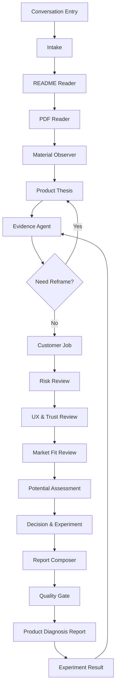

# Product Agent 技术实现 PRD

版本：MVP v1  
日期：2026-06-21  
目标：实现一个低成本、可上线、可观测的产品诊断 Agent。用户只提供一个对话输入和一个材料上传区，后续由 Agent 自动读取 README/材料、抓取网页证据、分析产品内部问题、判断产品潜力并生成报告。

## 1. 架构结论

MVP 采用：

> Deterministic Workflow + Main Product Agent + Tool Layer + Structured Output + Quality Gate

不采用完全自治 Agent，也不在第一版引入复杂多 Agent 框架。原因：

- 当前任务路径稳定：接收材料、读 README/PDF、抽取产品信息、抓取网页证据、判断潜力、诊断、推荐参考、输出行动。
- 早期最重要的是生成稳定报告和验证用户信号，不是开放式任务执行。
- 需要控制成本、延迟、失败面和调试复杂度。
- 只展示可观测 workflow trace，不展示模型隐藏思维链。

2026-06-25 更新：证据调研阶段升级为独立 Evidence Agent 模块。主流程仍保持 deterministic workflow，但 `Web Research` 不再只是网页摘要，而是 Evidence Agent 负责的结构化研究系统：

- critical assumptions
- evidence questions
- query matrix
- source triage
- evidence cards
- contrarian review
- evidence clusters
- confidence calibration
- validation experiment
- objective evidence protocol
- temporal validity / lifecycle calibration
- claim ledger
- evidence stop rule
- experiment result feedback loop

详细设计见 `EvidenceAgent证据调研系统PRD.md`。

## 2. 参考架构吸收点

### Claude Code

- 主会话保持简洁，专业任务由工具和子流程完成。
- 每一步都有明确上下文、权限和输出。
- 运行过程可恢复、可调试、可追踪。
- 对 Product Agent 的启发：把“产品判断”拆成可见步骤，而不是一个不可解释的大 prompt。

### Anthropic Effective Agents

- 优先用简单 workflow，而不是一开始做复杂自治系统。
- 使用 prompt chaining、routing、orchestrator-workers、evaluator-optimizer。
- 对 Product Agent 的启发：先用确定性节点串起流程，后续再把高价值节点升级成 subagent。

### OpenAI Agents SDK

- Agent = instructions + tools + handoffs + guardrails + tracing。
- tools 是能力边界，guardrails 是输入输出约束。
- 对 Product Agent 的启发：所有工具调用要记录输入摘要、输出摘要、耗时和状态。

### LangGraph

- 把 Agent 流程拆成节点和共享状态。
- checkpoint 支持恢复、人工介入和调试。
- 对 Product Agent 的启发：保存完整 AgentState，不只保存最终报告。

### MCP / Tool Protocol

- 工具通过清晰接口暴露给 Agent。
- 后续可以把 PDF、网页抓取、参考库、Figma、搜索能力迁移为独立 tool server。

## 3. 当前技术栈

应用层：

- Next.js 15。
- React 19。
- TypeScript。
- Route Handlers。
- 本地 JSON 存储。

AI 层：

- 智谱 / DeepSeek Chat Completions API。
- 默认策略：有 `ZHIPU_API_KEY` 时优先智谱 `glm-5.2`，否则使用 DeepSeek。
- 输出：JSON object + zod schema validation。

文件处理：

- PDF：服务端 `pdfplumber` 抽取文本。
- README / TXT：服务端读取文本、提取 URL。
- Web research：默认抓取 README 中出现的公开 URL；配置智谱搜索或 `SERPER_API_KEY` 后执行搜索。
- Code execution：实验 CSV/TSV/JSON 上传后，由 `code_executor` subagent 在受限 Python 中计算数据摘要，输出 `code_execution_result` artifact、`summary.json`、`summary.md` 和 `summary_chart.svg`；当前已有路径、资源、输出预算审计、SVG 预览、MIME/SVG 安全检查、durable replay、运行中取消、cleanup audit、报告页 worker queue 控制台和 replay 后实验证据局部刷新。`CODE_EXECUTOR_SANDBOX=auto|process|docker` 支持可选 Docker no-network 容器后端；docker 严格模式不可用时阻断，auto 不可用时带 warning 降级到进程级受限执行。取消请求会杀 Python 进程或 Docker 容器，并把 durable record、runtime queue item、task node 写成 `cancelled`。
- Worker daemon：`pnpm worker:local-drain` 可在浏览器请求之外消费 durable queue，写入 `.taste-data/worker-daemon` 心跳和 run log；`GET /api/worker-daemon` 读取 daemon 状态、stale 检测、supervisor state、launchd installed/loaded、health SLA 摘要、queue SLA/alerts、lease recovery 摘要、支持的 durable worker 类型和最近 run log；`POST /api/worker-daemon` 可启动/停止 detached 本地 managed supervisor。报告页 Subagent 运行账本展示 daemon/supervisor/launchd/health/queue SLA 状态，并支持刷新状态、启动/停止 daemon、手动 drain 当前 trace。`scripts/local-worker-supervisor.mjs` 会托管 `local-worker-drain` 子进程，子进程异常退出时自动退避重启，并记录 `restarts`、`workerPid`、`lastExit` 和 event log。`scripts/manage-worker-launchd.mjs` 与 `pnpm worker:launchd` 可生成 macOS LaunchAgent plist，支持 `status`、`print`、`install --load`、`load`、`unload`、`uninstall`，把 managed supervisor 变成开机常驻。`queueSla` 会扫描 durable queue records，输出 queued/running/failed/expired lease、最老 queued/running 年龄、按工具分布、失败 record 摘要和 `info/warning/critical` alerts，并并入 health 降级判断。`local-worker-drain` 的 heartbeat 会保留最后一次 drain 摘要，展示过期 lease requeue/fail/cancel 的数量和恢复 record。`worker-daemon-capabilities.ts` 显式声明当前 daemon drain 支持 `web_search`、`web_fetch`、`code_execute`、`evidence_extract`、`judge`、`model_report`；其中 `code_execute` 已通过 queued durable record 本地 drain 验证，`evidence_extract` 已通过 queued durable record 验证可基于既有 crawled/searchResults/queryExecutions 重建 evidence artifact 与 handoff，`judge` 和 `model_report` 已接入 durable replay，可回填 Judge verdict、报告、证据绑定和质量审计。当前仍不是带远端隔离和外部告警通道的生产级进程主管。
- 图片：浏览器 canvas 抽取基础视觉指标。
- 上传文件：保存到 `public/uploads/`。
- 分析记录：保存到 `.taste-data/analyses/`。

## 4. 用户入口

产品只保留一个主入口：

- 一个自然语言输入框。
- 一个材料上传按钮。

用户不需要选择作品类型、目标风格、诊断模式或参考方向。Agent 自动推断：

- workType。
- productName。
- product thesis。
- target audience。
- customer job。
- external evidence。
- product potential。
- product risks。
- next actions。

## 5. 工作流



## 6. Agent State

```ts
type AgentState = {
  analysisId: string;
  userInput: {
    brief: string;
    source?: "web" | "api";
  };
  materials: UploadedMaterial[];
  inferredContext: {
    workType: WorkType;
    productName: string;
    targetAudience?: string;
    productThesis?: string;
    customerJob?: string;
    targetFeeling: string;
    confidence: number;
  };
  observations: MaterialObservation[];
  webResearch: WebResearchSummary;
  risks: ProductRiskReview | null;
  references: ReferenceCandidate[];
  priorityPlan: PriorityAction[];
  report: ProductDiagnosisReport | null;
  trace: AgentTraceStep[];
};
```

## 7. Tool Use

### validate_materials

用途：校验文件类型、大小和数量。  
输入：uploaded files。  
输出：accepted / rejected / reason。

### normalize_user_brief

用途：整理用户自然语言说明。  
输入：brief。  
输出：clean brief / missing context notes。

### extract_pdf_text

用途：读取产品介绍 PDF、PRD 或 pitch deck。  
输入：PDF path。  
输出：extractedText、textPreview、pageCount。  
MVP 限制：前 8 页、最多约 12000 字。

### extract_readme_text

用途：读取 README、Markdown 或 TXT。  
输入：file path。  
输出：extractedText、textPreview、extractedUrls。  
MVP 限制：最多约 18000 字。

### crawl_extracted_urls

用途：抓取 README 里出现的公开官网、文档、demo、GitHub 或发布页。  
输入：URLs。  
输出：title、url、snippet。  
安全边界：拒绝 localhost、内网 IP、`.local`、`.internal`，每次最多 5 个 URL。

### web_search_market_context

用途：搜索产品名、替代方案、竞品、评论和市场信号。  
输入：query。  
输出：search results。  
MVP：使用可选 `SERPER_API_KEY`；未配置时标记为 skipped，不伪造搜索结果。

### summarize_product_brief

用途：从用户说明和 PDF 文本中提取产品上下文。  
输出：product summary、target audience、value proposition、launch context。

### extract_image_metrics

用途：在没有视觉模型的 MVP 中提供可观察视觉信号。  
输出：width、height、brightness、contrast、saturation、edgeDensity、dominantColors。

### summarize_material_manifest

用途：整理材料清单，让模型知道上下文来源。  
输出：材料名称、类型、大小、文本预览。

### extract_product_thesis

用途：提取产品承诺、目标用户、核心场景和差异化假设。  
输出：product thesis。

### identify_job_to_be_done

用途：判断用户想完成的进步、触发情境和替代方案。  
输出：customer job、alternatives。

### score_problem_intensity

用途：评估问题是否高频、痛、急、值钱或身份相关。  
输出：problem intensity notes。

### check_product_risks

用途：按四大风险检查产品。  
输出：

- value risk。
- usability risk。
- feasibility risk。
- business viability risk。

### review_clarity_and_trust

用途：检查信息层级、文案、可信证据、下一步和品牌一致性。  
输出：clarity issues、trust issues。

### check_market_fit_signal

用途：判断材料是否包含真实使用、留存、付费、传播或强需求信号。  
输出：market fit signal notes。

### score_product_potential

用途：判断产品是否值得继续投入。  
输入：README / PDF / crawled pages / search results / risk review。  
输出：potential_score、potential_verdict、market_evidence。

判断维度：

- 用户任务是否强。
- 是否存在外部需求信号。
- 替代方案是否清楚。
- 差异化 wedge 是否成立。
- 分发路径是否现实。
- 可信证据是否充分。
- 下一步实验是否能快速验证。

### check_distribution_fit

用途：判断发布渠道、传播话术和用户获取路径是否匹配。  
输出：distribution fit notes。

### search_reference_library

用途：从内置参考库匹配 3-5 个参考对象。  
输出：reference candidates。

### rank_product_actions

用途：按影响、确定性、成本、学习速度排序下一步。  
输出：priority actions。

### compose_structured_report

用途：生成最终结构化报告。  
输出：ProductDiagnosisReport JSON。

### schema_validate_report

用途：校验报告是否符合 schema、具体、可执行、与材料相关。  
输出：pass / repair once / failed。

## 8. Report Schema

```ts
type ProductDiagnosisReport = {
  diagnosis_score: number;
  potential_score: number;
  potential_verdict: string;
  first_impression: string;
  diagnosis_tags: string[];
  market_evidence: {
    signal: string;
    evidence: string;
    interpretation: string;
  }[];
  top_issues: {
    title: string;
    why_it_matters: string;
    how_to_fix: string;
  }[];
  references: {
    name: string;
    category: string;
    why_relevant: string;
    what_to_learn: string;
  }[];
  actionable_suggestions: string[];
  share_summary: {
    current_style: string;
    main_problem: string;
    recommended_references: string;
    one_line_diagnosis: string;
  };
  limitations: string[];
};
```

## 9. Prompt 原则

系统角色：

> senior software founder, product strategist, UX critic, copywriter, and go-to-market advisor

必须覆盖：

- 定位。
- 目标用户。
- 用户任务。
- 产品潜力。
- 市场证据。
- 替代方案。
- 差异化。
- 价值主张。
- 产品风险。
- 文案与信息层级。
- 体验和信任。
- 视觉表达。
- 转化路径。
- 发布和分发。

禁止：

- 只评价好不好看。
- 要求用户补表单。
- 输出空泛建议，例如“更高级”“更清晰”但不说明怎么改。
- 编造看不到的视觉事实。
- 把未执行的搜索说成已搜索。
- 把模型推断写成外部事实。
- 暴露隐藏思维链。

## 10. 数据模型

### UploadedMaterial

```ts
type UploadedMaterial = {
  id: string;
  name: string;
  type: string;
  size: number;
  url: string;
  metrics: ImageMetrics | null;
  extractedText?: string;
  textPreview?: string;
  pageCount?: number;
  extractedUrls?: string[];
};
```

### AgentTraceStep

```ts
type AgentTraceStep = {
  stage: AgentStage;
  title: string;
  status: "completed" | "failed" | "skipped";
  summary: string;
  toolCalls: AgentToolCall[];
};
```

### AgentToolCall

```ts
type AgentToolCall = {
  id: string;
  stage: AgentStage;
  toolName: string;
  status: "completed" | "failed" | "skipped";
  inputSummary: string;
  outputSummary: string;
  latencyMs: number;
};
```

## 11. API

### POST /api/analyses

输入：multipart/form-data

- `materials`: PDF / PNG / JPG / WebP files。
- `materials`: README / MD / TXT / PDF / PNG / JPG / WebP files。
- `brief`: 可选自然语言说明。
- `image_metrics`: 可选 JSON，由浏览器端生成。
- `product_variant`: 兼容旧路由，MVP 统一进入 Product Agent 体验。

输出：

```json
{
  "id": "analysis-id",
  "status": "completed",
  "report": {}
}
```

### GET /api/analyses/:id

输出：AnalysisRecord。

### POST /api/analyses/:id/experiment-result

输入：JSON 或 multipart/form-data。

- `rawEvidenceFiles`: CSV / TSV / JSON / TXT / PDF / 图片等实验原件。
- `rawEvidenceNotes`: 可选粘贴原始观察。
- `status` / `sampleSize` / `primaryMetricValue` / `evidenceSummary`。

输出：更新后的 Evidence Brief 和报告质量审计。CSV/TSV/JSON 会触发 `code_execute`，执行结果和 `summary_chart.svg` 作为实验计算证据回填。

### GET /api/worker-daemon

输入：query params。

- `limit`: 返回 daemon 数量，默认 8。
- `runLimit`: 每个 daemon 返回最近 run log 数，默认 3。
- `staleMs`: 心跳过期阈值，默认 45000。

输出：本地 worker daemon 心跳快照，包含 `supportedTools`、`daemonId`、`status`、`ageMs`、`stale`、`lastResult`、`supervisor` 和最近 run log。`lastResult.maintenance` 包含 lease recovery 计数和 `recoveredRecords` 摘要。报告页用它展示后台执行层是否仍然活着、是否由 supervisor 托管、是否发生过重启、是否恢复过过期 lease、当前支持哪些 durable worker 类型。

### POST /api/worker-daemon

输入：JSON。

- `action`: `start` 或 `stop`。
- `daemonId`: 可选，默认 `taste-agent-managed-worker`。
- `intervalMs` / `limit` / `scanLimit` / `concurrency` / `leaseMs` / `expiredMode`: 启动 daemon 时的 drain 参数。

输出：supervisor 操作结果。`start` 会启动 detached `scripts/local-worker-supervisor.mjs` 进程，由它托管 `scripts/local-worker-drain.mjs --watch` 子进程；`stop` 会写入 control file 并向 supervisor pid 发送 SIGTERM，supervisor 再停止子进程，脚本收到信号后写入 `stopped` heartbeat。

## 12. 质量门禁

zod schema 校验：

- `diagnosis_score` 必须为 0-100 整数。
- `potential_score` 必须为 0-100 整数。
- `diagnosis_tags` 必须 3-6 条。
- `market_evidence` 必须 3-6 条。
- `top_issues` 必须 3-5 条。
- `references` 必须 3-5 条。
- `actionable_suggestions` 必须 5-10 条。

语义质量要求：

- 每个问题必须说明业务影响。
- 每条建议必须能执行。
- 推荐参考必须说明具体学习点。
- limitations 必须承认材料不足或视觉不确定性。

## 13. MVP 实现状态

已实现：

- 单入口首页。
- 多材料上传。
- PDF 文本抽取。
- README / TXT 文本抽取。
- README URL 提取。
- 安全抓取公开 URL。
- 可选 Serper 网页搜索。
- 图片指标抽取。
- 确定性 workflow trace。
- DeepSeek JSON 报告生成。
- fallback 报告。
- 报告页和分享卡片。
- 本地存储。

下一步：

- 引入 evaluator model 做报告质量修复。
- 增加 URL 抓取和 OCR。
- 增加参考库搜索。
- 增加人工增强队列。
- 增加匿名分享页和事件埋点。

## 14. 风险

### DeepSeek 输出不稳定

应对：zod schema validation + fallback report + 后续 evaluator repair。

### PDF 抽取失败

应对：报告 limitations 标记；P1 增加 OCR。

### 图片理解不足

应对：当前用 canvas 指标做低成本 MVP；P1 可接入视觉模型。

### 报告泛化

应对：prompt 强制使用大师产品判断框架，且每个 issue 必须解释影响和修复动作。

### 用户不愿上传材料

应对：明确本地存储、默认不公开；社媒先做免费诊断换反馈。

## 15. 验证计划

技术验证：

- `tsc --noEmit`。
- `next build`。
- PDF 上传 API 测试。
- README 上传 API 测试。
- README URL 抓取测试。
- 首页和报告页截图检查。

产品验证：

- 发 3-5 条不同社媒文案。
- 收集前 20 个真实产品材料。
- 记录上传率、报告完成率、分享率和人工诊断申请率。
- 对用户反馈做标签：说中、太泛、想付费、想让它直接改。
